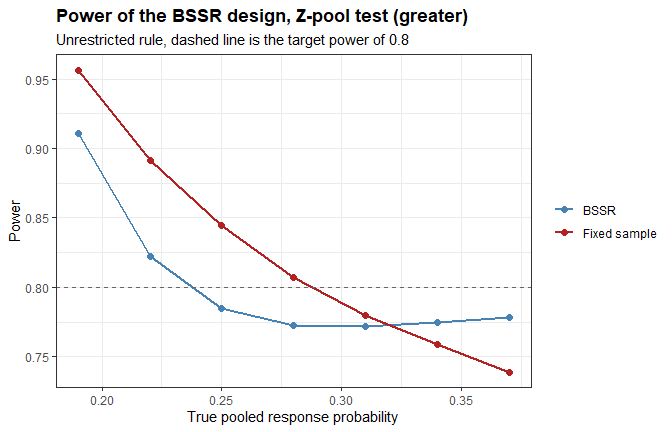

<!-- README.md is generated from README.Rmd. Please edit that file -->

# bbssr: Blinded Sample Size Re-Estimation for Binary Endpoints 

<!-- badges: start -->

[](https://CRAN.R-project.org/package=bbssr)
[](https://github.com/gosukehommaEX/bbssr/actions/workflows/R-CMD-check.yaml)
[](https://github.com/gosukehommaEX/bbssr/actions/workflows/pkgdown.yaml)
[](https://cranlogs.r-pkg.org/badges/grand-total/bbssr)
[](https://cranlogs.r-pkg.org/badges/bbssr)
<!-- badges: end -->

## Overview

A trial with a binary endpoint needs an assumed response probability in
each group before the first patient is enrolled. If the pooled response
probability turns out to differ from what was assumed, the trial ends up
either underpowered or larger than it needed to be. Blinded sample size
re-estimation looks at the pooled number of responders partway through
the trial and adjusts the remaining enrolment, without ever splitting
the data by treatment group.

`bbssr` covers the whole chain of calculations that this requires, from
the rejection region of a test to the enrolment decision at an interim
analysis. Power, sample sizes and type I error rates are computed
exactly rather than by simulation.

## What is new since version 2.0.0

- Two tests of non-inferiority with a margin on the scale of the risk
  difference or, with `margin.scale = 'RR'`, of the risk ratio,
  `Test = 'Blackwelder'` and `Test = 'Farrington-Manning'`, and the
  blinded re-estimation of Friede, Mitchell and Mueller-Velten (2007).
- `BinaryTypeIErrorBSSR()` evaluates the type I error rate of a
  re-estimation design over the nuisance parameter and finds its largest
  value over the whole range together with an upper bound,
  `BinaryAlphaAdjBSSR()` finds the adjusted significance level that
  controls it, and `BinaryCondRejectBSSR()` decomposes it by the interim
  outcome.
- `BinaryGridBSSR()` evaluates several designs, given as the rows of a
  data frame, over common scenarios.
- The sample size can be re-estimated by the normal approximation
  (`ss.method`), with another test or level (`ss.Test`, `ss.alpha`),
  with one of several rounding rules (`rounding`), within bounds on the
  final sample size (`N.min`, `N.max`), from given interim sample sizes
  (`n.interim`) and with an effect on the scale of the risk ratio or the
  odds ratio (`effect`).
- Every function accepts `alternative = 'less'`, and `ref.pvalue = TRUE`
  refines the maximization over the nuisance parameter of the
  unconditional tests.
- `tsmethod = 'blaker'` adds a third two-sided convention for the
  Fisher, Fisher mid-p and Boschloo tests, formula (2) of Mehrotra, Chan
  and Berger (2003).
- `search` chooses among three exact sample size searches: the default,
  which stops where the power crosses the target, the smallest size that
  attains the target, and the smallest size from which every size up to
  a limit attains it.
- `summary()` of `BinaryPowerBSSR()` reports the distribution of the
  final sample size.

See [NEWS.md](https://github.com/gosukehommaEX/bbssr/blob/main/NEWS.md)
for the full list.

## Installation

``` r
install.packages("bbssr")
```

``` r
# install.packages("devtools")
devtools::install_github("gosukehommaEX/bbssr")
```

A C++ compiler is required to install from source.

## The seven tests

| `Test` | Description | Exact level |
|----|----|----|
| `'Chisq'` | Pearson chi-squared, no continuity correction | no |
| `'Fisher'` | Fisher exact test, conditional on the total number of responders | yes |
| `'Fisher-midP'` | Mid-p variant of the Fisher exact test | no |
| `'Z-pool'` | Exact unconditional test, Z statistic with pooled variance | yes, up to the grid search |
| `'Boschloo'` | Exact unconditional test, Fisher p-value as ordering statistic | yes, up to the grid search |
| `'Blackwelder'` | Test of non-inferiority with the standard error at the observed proportions | no |
| `'Farrington-Manning'` | Test of non-inferiority with the standard error at the restricted maximum likelihood estimates | no |

The column “Exact level” refers to a fixed-sample design. The two
unconditional tests maximize the null tail probability over a grid of
the nuisance parameter, which can understate the exact p-value, and
`ref.pvalue = TRUE` refines the maximum between the grid points. Without
the Berger-Boos procedure the Boschloo p-value never exceeds the Fisher
p-value, so the Boschloo test is at least as powerful as the Fisher test
at every pair of response probabilities. The rejection regions, power
and sample sizes of all seven tests are computed exactly.

Every test accepts `alternative = 'greater'`, `'less'` or `'two.sided'`.
For the conditional tests and the Boschloo test, `tsmethod` selects
among the `'minlike'` convention of `stats::fisher.test`, the
`'central'` convention that doubles the smaller tail, and the `'blaker'`
convention that orders the tables by the smaller of their two tail
probabilities. A margin other than 0, and any margin on the scale of the
risk ratio, requires `'Blackwelder'` or `'Farrington-Manning'` and a
one-sided alternative.

## Quick start

### Power and sample size

``` r
library(bbssr)

BinaryPower(p1 = 0.6, p2 = 0.3, N1 = 40, N2 = 40, alpha = 0.025, Test = 'Fisher')
#> Exact power for a two-arm trial with a binary endpoint
#> 
#>   Test         : Fisher
#>   Alternative  : greater
#>   Sample sizes : N1 = 40, N2 = 40
#>   Alpha        : 0.025
#> 
#>   p1  p2  Power
#>  0.6 0.3 0.7248

BinarySampleSize(p1 = 0.6, p2 = 0.3, r = 1, alpha = 0.025, tar.power = 0.8,
                 Test = 'Fisher')
#> Sample size for a two-arm trial with a binary endpoint
#> 
#>   Test             : Fisher
#>   Alternative      : greater
#>   Response rates   : p1 = 0.6, p2 = 0.3
#>   Allocation ratio : 1 to 1
#>   Alpha            : 0.025
#>   Target power     : 0.8
#>   Exact search     : crossing
#> 
#>   Required sample size: N1 = 48, N2 = 48, total N = 96
#>   Attained power      : 0.8005
```

The exact power is not monotone in the sample size, because the set of
attainable significance levels changes with every patient, so the search
evaluates the exact power at each candidate rather than inverting a
smooth approximation.

### Rejection regions

``` r
RR <- BinaryRR(N1 = 10, N2 = 10, alpha = 0.025, Test = 'Boschloo')
RR
#> Rejection region for a two-arm trial with a binary endpoint
#> 
#>   Test          : Boschloo
#>   Alternative   : greater
#>   Sample sizes  : N1 = 10, N2 = 10
#>   Alpha         : 0.025
#>   Grid points   : 100
#>   Berger-Boos   : not used
#>   Refinement    : not used
#> 
#>   Rejected outcomes: 23 of 121
#> 
#>       x2=0 x2=1 x2=2 x2=3 x2=4 x2=5 x2=6 x2=7 x2=8 x2=9 x2=10
#> x1=0  .    .    .    .    .    .    .    .    .    .    .    
#> x1=1  .    .    .    .    .    .    .    .    .    .    .    
#> x1=2  .    .    .    .    .    .    .    .    .    .    .    
#> x1=3  .    .    .    .    .    .    .    .    .    .    .    
#> x1=4  X    .    .    .    .    .    .    .    .    .    .    
#> x1=5  X    .    .    .    .    .    .    .    .    .    .    
#> x1=6  X    X    .    .    .    .    .    .    .    .    .    
#> x1=7  X    X    X    .    .    .    .    .    .    .    .    
#> x1=8  X    X    X    X    .    .    .    .    .    .    .    
#> x1=9  X    X    X    X    X    .    .    .    .    .    .    
#> x1=10 X    X    X    X    X    X    X    .    .    .    .    
#> 
#>   X marks rejection of the null hypothesis
```

The whole grid of p-values is computed in one pass and kept for the rest
of the session, so a power curve costs little more than a single
p-value.

### Evaluating a re-estimation design

``` r
plan <- BinarySampleSize(p1 = 0.45, p2 = 0.09, r = 1, alpha = 0.025, tar.power = 0.8,
                         Test = 'Z-pool')
res <- BinaryPowerBSSR(
  p = seq(0.19, 0.37, by = 0.03), Delta.A = 0.36, Delta.T = 0.36,
  N1 = plan$N1, N2 = plan$N2, omega = 0.5, r = 1,
  alpha = 0.025, tar.power = 0.8, Test = 'Z-pool'
)
res
#> Blinded sample size re-estimation for a binary endpoint
#> 
#>   Test            : Z-pool
#>   Alternative     : greater
#>   Design rule     : unrestricted
#>   Initial size    : N1 = 24, N2 = 24
#>   Interim fraction: 0.5, giving n1 = 12 and n2 = 12
#>   Treatment effect: assumed 0.36, true 0.36 (risk difference)
#>   Re-estimation   : exact power of Z-pool at level 0.025
#>   Alpha           : 0.025, target power 0.8
#> 
#>     p   p1   p2 power.BSSR power.TRAD  E.N
#>  0.19 0.37 0.01     0.9107     0.9565 38.2
#>  0.22 0.40 0.04     0.8221     0.8916 40.6
#>  0.25 0.43 0.07     0.7848     0.8442 43.5
#>  0.28 0.46 0.10     0.7727     0.8070 46.6
#>  0.31 0.49 0.13     0.7718     0.7800 49.4
#>  0.34 0.52 0.16     0.7747     0.7590 51.9
#>  0.37 0.55 0.19     0.7783     0.7388 53.9
plot(res)
```



The variance of a binary endpoint is largest at one half, so at a fixed
risk difference the required sample size grows as the pooled probability
approaches that value. The fixed-sample design of 48 patients is planned
at a pooled probability of 0.27. The re-estimation adapts the sample
size to the pooled probability observed at the interim analysis, and
`E.N` reports the expected total sample size it leads to.

### Type I error rate and adjusted level

``` r
tie <- BinaryTypeIErrorBSSR(
  Delta.A = 0.3, N1 = 39, N2 = 39, n.interim = c(20, 20), r = 1,
  alpha = 0.025, tar.power = 0.8, Test = 'Chisq', ss.method = 'standard'
)
tie
#> Type I error rate of blinded sample size re-estimation for a binary endpoint
#> 
#>   Test            : Chisq
#>   Alternative     : greater
#>   Initial size    : N1 = 39, N2 = 39
#>   Interim size    : n1 = 20, n2 = 20
#>   Assumed effect  : 0.3 (RD)
#>   Nominal level   : 0.025
#>   Grid            : 201 values of theta in [0, 1]
#>   Maximum         : certified over theta in [0, 1]
#> 
#> Largest type I error rate
#>        Design     theta     TIE
#>          BSSR 0.4376830 0.02729
#>  Fixed sample 0.0935669 0.02938

BinaryAlphaAdjBSSR(
  Delta.A = 0.3, N1 = 39, N2 = 39, n.interim = c(20, 20), r = 1,
  alpha = 0.025, tar.power = 0.8, Test = 'Chisq', ss.method = 'standard'
)
#> Adjusted significance level for blinded sample size re-estimation
#> 
#>   Test            : Chisq
#>   Alternative     : greater
#>   Adjusted part   : final analysis only
#>   Maximum         : certified over theta in [0, 1]
#>   Target level    : 0.025
#> 
#>        Design   max.TIE alpha.adj max.TIE.adj
#>          BSSR 0.0272864 0.0204375   0.0237418
#>  Fixed sample 0.0293761 0.0207700   0.0247660
```

The type I error rate is computed exactly over the common response
probability. Its largest value over the whole interval spanned by
`theta`, by default from 0 to 1, is found together with an upper bound,
so it does not depend on the spacing of the grid. The adjusted level is
found by lowering the nominal level until this bound does not exceed the
target level. It is reported with at most six significant digits where
the rejection regions allow, so the printed value can be used as it is.

### Comparing designs

``` r
design <- expand.grid(Test = c('Chisq', 'Fisher'), omega = c(0.3, 0.5),
                      stringsAsFactors = FALSE)
grid <- BinaryGridBSSR(design, p = c(0.3, 0.4, 0.5), Delta.A = 0.3, N1 = 30, N2 = 30,
                       r = 1, alpha = 0.025, tar.power = 0.8, ss.method = 'standard')
summary(grid)
#>   design   Test omega N1 N2 n1.interim n2.interim Delta.T power.BSSR.min
#> 1      1  Chisq   0.3 30 30          9          9     0.3      0.7716927
#> 2      2 Fisher   0.3 30 30          9          9     0.3      0.6913132
#> 3      3  Chisq   0.5 30 30         15         15     0.3      0.7885735
#> 4      4 Fisher   0.5 30 30         15         15     0.3      0.7026320
#>   power.BSSR.max power.TRAD.min power.TRAD.max  E.N.max
#> 1      0.7932220      0.6617280      0.7369757 81.24550
#> 2      0.7225466      0.5593173      0.6447901 81.24550
#> 3      0.7982702      0.6617280      0.7369757 83.27159
#> 4      0.7265063      0.5593173      0.6447901 83.27159
```

### Re-estimating from observed interim data

``` r
BinaryBSSR(n1 = 12, n2 = 12, S = 8, Delta.A = 0.36, r = 1,
           alpha = 0.025, tar.power = 0.8, Test = 'Z-pool')
#> Blinded sample size re-estimation from interim data
#> 
#>   Test             : Z-pool
#>   Alternative      : greater
#>   Design rule      : unrestricted
#>   Assumed effect   : 0.36
#>   Alpha            : 0.025, target power 0.8
#> 
#> Interim data
#>   Patients         : n1 = 12, n2 = 12, total n = 24
#>   Responders       : S = 8, blinded pooled rate = 0.3333
#>   Recovered rates  : hat.p1 = 0.5133, hat.p2 = 0.1533
#> 
#> Re-estimation
#>   Required total   : N1 = 27, N2 = 27, total N = 54
#>   Still to enrol   : group 1 = 15, group 2 = 15, total = 30
#>   Final size       : N1 = 27, N2 = 27, total N = 54
#>   Power at final N : 0.8129
```

The total number of responders is the only quantity that has to leave
the database, so the analysis stays blinded.

## Functions

| Function | Purpose |
|----|----|
| `BinaryRR()` | Rejection region of a test over the outcome grid |
| `BinaryPower()` | Exact power at a given sample size |
| `BinarySampleSize()` | Sample size attaining a target power |
| `BinaryPowerBSSR()` | Power and distribution of the final sample size of a re-estimation design |
| `BinaryGridBSSR()` | Power and final sample size of several re-estimation designs |
| `BinaryTypeIErrorBSSR()` | Type I error rate of a re-estimation design |
| `BinaryAlphaAdjBSSR()` | Adjusted significance level that controls the type I error rate |
| `BinaryCondRejectBSSR()` | Conditional rejection probabilities and the type I error rate by interim outcome |
| `BinaryBSSR()` | Sample size re-estimation from observed interim data |

Each returns a classed object with a `print()`, `summary()` or `plot()`
method where one is useful.

## Design rules

Under the **unrestricted** rule (`restricted = FALSE`) the re-estimated
sample size is used as it stands, so the trial may end up smaller than
planned. Under the **restricted** rule (`restricted = TRUE`) the planned
sample size acts as a floor, so the trial can only grow. `N.min` and
`N.max` add a lower and an upper bound on the final total sample size.

## Documentation

The vignettes are available with `vignette(package = "bbssr")` and on
the [package website](https://gosukehommaex.github.io/bbssr/).

- `bbssr-introduction`: the whole package in one pass
- `bbssr-interim-reestimation`: one trial from planning to the interim
  decision
- `bbssr-reestimation-rules`: the options of the re-estimation
- `bbssr-design-grid`: comparing designs with `BinaryGridBSSR()`
- `bbssr-non-inferiority`: tests with a margin and re-estimation in
  non-inferiority trials
- `bbssr-type1-error`: type I error rate, adjusted level and conditional
  rejection probabilities
- `bbssr-statistical-methods`: the tests and the re-estimation
- `bbssr-validation`: comparisons with other packages and with published
  results
- `bbssr-published-figures`: fifteen published figures redrawn from
  values computed with the package

## Validation

The Fisher exact test reproduces `stats::fisher.test` to machine
precision, and its `'blaker'` convention reproduces `exact2x2`. The
mid-p test reproduces its definition under every convention, and
`exact2x2` for the one-sided and the `'central'` p-values. The
unconditional tests reproduce a direct evaluation of their definition,
and agree with `Exact` and `exact2x2` up to the difference in the search
over the nuisance parameter. The script
`inst/reproduce/reproduce-published.R` recomputes the published results
of Berger and Boos (1994), Blackwelder (1982), Boschloo (1970),
Farrington and Manning (1990), Fay and Hunsberger (2021), Friede and
Kieser (2004), Friede, Mitchell and Mueller-Velten (2007), Kieser (2020)
and Mehrotra, Chan and Berger (2003), and the unit tests compare the
package with independent implementations. Details are in the validation
vignette, and the `bbssr-published-figures` vignette redraws fifteen
published figures of Friede and Kieser (2004), Kieser (2020), Friede,
Mitchell and Mueller-Velten (2007) and Boschloo (1970).

## References

The methods implemented in the package are described in the following
works.

Berger, R. L. and Boos, D. D. (1994). P values maximized over a
confidence set for the nuisance parameter. *Journal of the American
Statistical Association*, 89, 1012-1016.

Blackwelder, W. C. (1982). “Proving the null hypothesis” in clinical
trials. *Controlled Clinical Trials*, 3, 345-353.

Boschloo, R. D. (1970). Raised conditional level of significance for the
2 × 2-table when testing the equality of two probabilities. *Statistica
Neerlandica*, 24, 1-9.

Farrington, C. P. and Manning, G. (1990). Test statistics and sample
size formulae for comparative binomial trials with null hypothesis of
non-zero risk difference or non-unity relative risk. *Statistics in
Medicine*, 9, 1447-1454.

Fay, M. P. and Hunsberger, S. A. (2021). Practical valid inferences for
the two-sample binomial problem. *Statistics Surveys*, 15, 72-110.

Friede, T. and Kieser, M. (2004). Sample size recalculation for binary
data in internal pilot study designs. *Pharmaceutical Statistics*, 3,
269-279.

Friede, T., Mitchell, C. and Mueller-Velten, G. (2007). Blinded sample
size reestimation in non-inferiority trials with binary endpoints.
*Biometrical Journal*, 49, 903-916.

Kieser, M. (2020). *Methods and Applications of Sample Size Calculation
and Recalculation in Clinical Trials*. Springer.

Kieser, M. and Friede, T. (2000). Re-calculating the sample size in
internal pilot study designs with control of the type I error rate.
*Statistics in Medicine*, 19, 901-911.

Mehrotra, D. V., Chan, I. S. F. and Berger, R. L. (2003). A cautionary
note on exact unconditional inference for a difference between two
independent binomial proportions. *Biometrics*, 59, 441-450.

## License

MIT, see [LICENSE.md](LICENSE.md).

## Author

Gosuke Homma

------------------------------------------------------------------------

This package is intended for statisticians and clinical researchers
familiar with adaptive trial designs. For a regulatory submission,
consult biostatisticians and regulatory affairs specialists about the
applicable guidelines.
