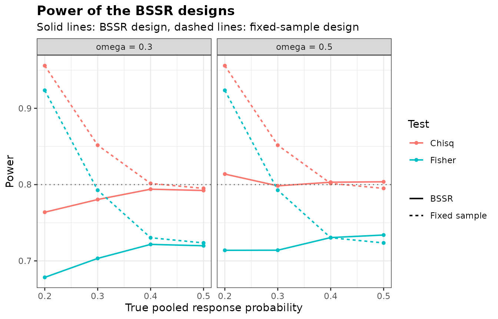
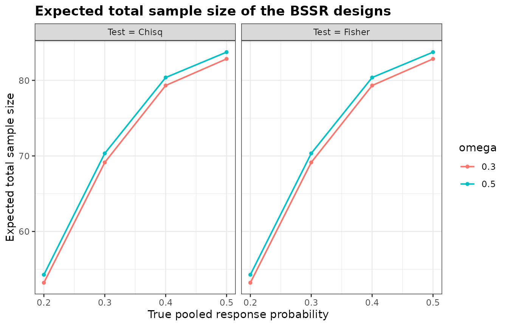

# Comparing Designs with BinaryGridBSSR

``` r

library(bbssr)
```

## One data frame for many designs

Choosing a design means comparing several candidates, for example tests,
timings of the interim analysis or assumed effects, over the same
scenarios.
[`BinaryGridBSSR()`](https://gosukehommaex.github.io/bbssr/reference/BinaryGridBSSR.md)
takes the candidates as the rows of a data frame, evaluates each with
[`BinaryPowerBSSR()`](https://gosukehommaex.github.io/bbssr/reference/BinaryPowerBSSR.md)
at common true pooled response probabilities, and returns one data frame
with a row for each design and each probability.

The columns of the design data frame are arguments of
[`BinaryPowerBSSR()`](https://gosukehommaex.github.io/bbssr/reference/BinaryPowerBSSR.md).
Arguments shared by all designs are given through `...`, and an argument
may not appear in both places. Below, two tests are crossed with two
timings of the interim analysis.

``` r

design <- expand.grid(Test = c('Chisq', 'Fisher'), omega = c(0.3, 0.5),
                      stringsAsFactors = FALSE)
design
#>     Test omega
#> 1  Chisq   0.3
#> 2 Fisher   0.3
#> 3  Chisq   0.5
#> 4 Fisher   0.5
grid <- BinaryGridBSSR(design, p = seq(0.2, 0.5, by = 0.1), Delta.A = 0.3,
                       N1 = 40, N2 = 40, r = 1, alpha = 0.025, tar.power = 0.8,
                       ss.method = 'standard')
head(grid)
#>   design   Test omega N1 N2 n1.interim n2.interim Delta.T   p   p1   p2
#> 1      1  Chisq   0.3 40 40         12         12     0.3 0.2 0.35 0.05
#> 2      1  Chisq   0.3 40 40         12         12     0.3 0.3 0.45 0.15
#> 3      1  Chisq   0.3 40 40         12         12     0.3 0.4 0.55 0.25
#> 4      1  Chisq   0.3 40 40         12         12     0.3 0.5 0.65 0.35
#> 5      2 Fisher   0.3 40 40         12         12     0.3 0.2 0.35 0.05
#> 6      2 Fisher   0.3 40 40         12         12     0.3 0.3 0.45 0.15
#>   power.BSSR power.TRAD      E.N      SD.N N.q25 N.q50 N.q75     P.N.max
#> 1  0.7637930  0.9558550 53.21531 14.139995    48    56    64 0.001538681
#> 2  0.7804500  0.8516117 69.13978 12.257967    64    70    80 0.060350142
#> 3  0.7939654  0.8015039 79.32101  8.020970    76    80    86 0.298488859
#> 4  0.7922767  0.7950585 82.84026  4.901025    80    84    86 0.479237344
#> 5  0.6784007  0.9235441 53.21531 14.139995    48    56    64 0.001538681
#> 6  0.7032579  0.7926367 69.13978 12.257967    64    70    80 0.060350142
```

Each row holds the index `design`, the columns of the design data frame,
the initial and interim sample sizes, the true effect, the true response
probabilities, the power of the re-estimation design and of the
fixed-sample design, and the expected value, standard deviation and
quartiles of the final total sample size. `P.N.max` is the probability
that the final total takes the largest value that any interim outcome
leads to.

## Summaries and plots

[`summary()`](https://rdrr.io/r/base/summary.html) gives one row per
design, with the range of the power over the scenarios and the largest
expected total sample size.

``` r

grid.summary <- summary(grid)
grid.summary
#>   design   Test omega N1 N2 n1.interim n2.interim Delta.T power.BSSR.min
#> 1      1  Chisq   0.3 40 40         12         12     0.3      0.7637930
#> 2      2 Fisher   0.3 40 40         12         12     0.3      0.6784007
#> 3      3  Chisq   0.5 40 40         20         20     0.3      0.7983571
#> 4      4 Fisher   0.5 40 40         20         20     0.3      0.7138677
#>   power.BSSR.max power.TRAD.min power.TRAD.max  E.N.max
#> 1      0.7939654      0.7950585      0.9558550 82.84026
#> 2      0.7216303      0.7235412      0.9235441 82.84026
#> 3      0.8138014      0.7950585      0.9558550 83.73642
#> 4      0.7338985      0.7235412      0.9235441 83.73642
```

With Fisher’s exact test in the final analysis the power of the
re-estimation design stays at or below 0.734. The sample size is
re-estimated here by the normal approximation of
`ss.method = 'standard'`, which does not depend on the test, and
Fisher’s test needs more patients than the chi-squared test to reach the
same power. The exact re-estimation of `ss.method = 'exact'` uses the
exact power of the test of the final analysis instead.

[`plot()`](https://rdrr.io/r/graphics/plot.default.html) draws the power
or the expected total sample size against the true pooled response
probability, with one colour per value of a column and, optionally, one
panel per value of another.

``` r

plot(grid, colour.by = 'Test', facet.by = 'omega')
```



The re-estimation of `ss.method = 'standard'` does not depend on the
test, so the expected total sample size is the same for the two tests,
and the panels below, one per test, show the same curves.

``` r

plot(grid, what = 'E.N', colour.by = 'omega', facet.by = 'Test')
```



## Initial sample sizes from a planning proportion

Instead of the columns `N1` and `N2`, a design can give a pooled
planning proportion `p.plan`. The planning proportions of the two groups
are then obtained from `p.plan` and the assumed effect, as in the
re-estimation, and the initial sample sizes are those of
[`BinarySampleSize()`](https://gosukehommaex.github.io/bbssr/reference/BinarySampleSize.md)
with the test, level, target power and allocation ratio of the design,
the method `ss.method` of the re-estimation and its rounding rule. With
`type1 = TRUE` the largest type I error rates of each design and of its
fixed-sample counterpart are added to the attribute `designs`, as
computed by
[`BinaryTypeIErrorBSSR()`](https://gosukehommaex.github.io/bbssr/reference/BinaryTypeIErrorBSSR.md).

``` r

planned <- data.frame(Delta.A = c(0.2, 0.25, 0.3), p.plan = 0.35)
grid.plan <- BinaryGridBSSR(planned, p = seq(0.2, 0.5, by = 0.1), omega = 0.5, r = 1,
                            alpha = 0.025, tar.power = 0.8, Test = 'Chisq',
                            ss.method = 'standard', type1 = TRUE)
attr(grid.plan, 'designs')
#>   design Delta.A p.plan N1 N2 n1.interim n2.interim Delta.T   TIE.BSSR
#> 1      1    0.20   0.35 89 89         45         45    0.20 0.03001093
#> 2      2    0.25   0.35 56 56         28         28    0.25 0.02845298
#> 3      3    0.30   0.35 39 39         20         20    0.30 0.02728643
#>   theta.BSSR   TIE.TRAD theta.TRAD
#> 1  0.9189958 0.02699911 0.40503913
#> 2  0.5000000 0.02588123 0.19815741
#> 3  0.5623154 0.02937611 0.09356712
```

## Designs specified in different ways

A missing value in a column means that the argument is not given for
that design. Designs whose interim analysis is given by `omega` and
designs whose interim sample sizes are given by the columns `n1.interim`
and `n2.interim` can therefore share one data frame.

``` r

mixed <- data.frame(omega = c(0.5, NA), n1.interim = c(NA, 12), n2.interim = c(NA, 12))
grid.mixed <- BinaryGridBSSR(mixed, p = 0.35, Delta.A = 0.3, N1 = 40, N2 = 40, r = 1,
                             alpha = 0.025, tar.power = 0.8, Test = 'Chisq',
                             ss.method = 'standard')
grid.mixed[, c('design', 'n1.interim', 'n2.interim', 'power.BSSR', 'E.N')]
#>   design n1.interim n2.interim power.BSSR      E.N
#> 1      1         20         20  0.7992496 76.20709
#> 2      2         12         12  0.7878232 75.01443
```

## A true effect other than the assumed one

The power is evaluated at the assumed effect of each design unless
`Delta.T` gives the true effect, either as an argument for all designs
or as a column of the design data frame.

``` r

grid.smaller <- BinaryGridBSSR(design, p = seq(0.2, 0.5, by = 0.1), Delta.T = 0.2,
                               Delta.A = 0.3, N1 = 40, N2 = 40, r = 1, alpha = 0.025,
                               tar.power = 0.8, ss.method = 'standard')
summary(grid.smaller)
#>   design   Test omega N1 N2 n1.interim n2.interim Delta.T power.BSSR.min
#> 1      1  Chisq   0.3 40 40         12         12     0.2      0.4348320
#> 2      2 Fisher   0.3 40 40         12         12     0.2      0.3309078
#> 3      3  Chisq   0.5 40 40         20         20     0.2      0.4592584
#> 4      4 Fisher   0.5 40 40         20         20     0.2      0.3448173
#>   power.BSSR.max power.TRAD.min power.TRAD.max  E.N.max
#> 1      0.4561124      0.4576277      0.6322417 82.64734
#> 2      0.3655610      0.3682412      0.5339860 82.64734
#> 3      0.4669846      0.4576277      0.6322417 83.62765
#> 4      0.3740034      0.3682412      0.5339860 83.62765
```

Errors and warnings raised while a design is evaluated are prefixed with
the index of the design, and `verbose = TRUE` reports the progress. The
p-values of each test are kept for the rest of the session, so designs
that share sample sizes are evaluated faster after the first one.
