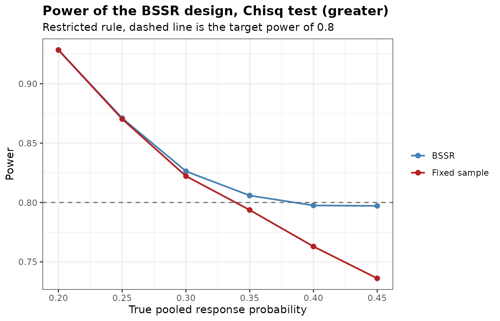

# Re-estimating the Sample Size from Interim Data

``` r

library(bbssr)
```

## Two questions, two functions

[`BinaryPowerBSSR()`](https://gosukehommaex.github.io/bbssr/reference/BinaryPowerBSSR.md)
answers a design question. Given a re-estimation rule, what is the power
and the expected sample size across the scenarios that might occur? It
averages over every possible interim outcome, and it is used before the
trial starts.

[`BinaryBSSR()`](https://gosukehommaex.github.io/bbssr/reference/BinaryBSSR.md)
answers an operational question. The interim analysis has produced one
specific number, so how many more patients must be enrolled? It is used
once, while the trial is running.

This vignette follows a single trial through both.

## Planning

A trial compares an experimental treatment against control with a binary
response endpoint. The clinical team assumes a response probability of
0.45 under treatment and 0.20 under control, so a risk difference of
0.25. Randomization is one to one, the one-sided level is 0.025 and the
target power is 0.80. The Z-pooled exact unconditional test is chosen.

``` r

Delta.A <- 0.25
plan <- BinarySampleSize(p1 = 0.45, p2 = 0.20, r = 1, alpha = 0.025,
                         tar.power = 0.8, Test = 'Z-pool')
plan
#> Sample size for a two-arm trial with a binary endpoint
#> 
#>   Test             : Z-pool
#>   Alternative      : greater
#>   Response rates   : p1 = 0.45, p2 = 0.2
#>   Allocation ratio : 1 to 1
#>   Alpha            : 0.025
#>   Target power     : 0.8
#>   Exact search     : crossing
#> 
#>   Required sample size: N1 = 54, N2 = 54, total N = 108
#>   Attained power      : 0.8038
```

The assumed pooled response probability is 0.325. Its value also drives
the required sample size, and unlike the risk difference it can be
estimated from blinded data, which is what makes it worth re-estimating.

``` r

pooled <- seq(0.20, 0.45, by = 0.05)
sens <- data.frame(
  pooled = pooled,
  p1 = pooled + Delta.A / 2,
  p2 = pooled - Delta.A / 2
)
sens$N <- vapply(seq_len(nrow(sens)), function(i) {
  BinarySampleSize(sens$p1[i], sens$p2[i], 1, 0.025, 0.8, 'Chisq')$N
}, numeric(1))
sens
#>   pooled    p1    p2   N
#> 1   0.20 0.325 0.075  74
#> 2   0.25 0.375 0.125  88
#> 3   0.30 0.425 0.175 102
#> 4   0.35 0.475 0.225 110
#> 5   0.40 0.525 0.275 120
#> 6   0.45 0.575 0.325 120
```

The required total sample size goes from 74 at a pooled probability of
0.2 to 120 at 0.45, while the risk difference stays fixed at 0.25. The
reason is that the variance of a binary endpoint is largest at one half,
so a pooled probability closer to that value costs patients. An error in
the assumed pooled probability is therefore expensive, and it is exactly
the quantity that blinded interim data can estimate.

## Evaluating the re-estimation rule

Before committing to the design, check what the re-estimation buys. The
interim analysis is placed at half of the planned sample size. The
evaluations in this vignette use the chi-squared test, whose rejection
regions are quicker to compute than those of the Z-pooled test, as an
approximation to the final analysis.

``` r

design <- BinaryPowerBSSR(
  p = seq(0.20, 0.45, by = 0.05),
  Delta.A = Delta.A, Delta.T = Delta.A,
  N1 = plan$N1, N2 = plan$N2, omega = 0.5, r = 1,
  alpha = 0.025, tar.power = 0.8, Test = 'Chisq',
  restricted = TRUE
)
design
#> Blinded sample size re-estimation for a binary endpoint
#> 
#>   Test            : Chisq
#>   Alternative     : greater
#>   Design rule     : restricted
#>   Initial size    : N1 = 54, N2 = 54
#>   Interim fraction: 0.5, giving n1 = 27 and n2 = 27
#>   Treatment effect: assumed 0.25, true 0.25 (risk difference)
#>   Re-estimation   : exact power of Chisq at level 0.025
#>   Alpha           : 0.025, target power 0.8
#> 
#>     p    p1    p2 power.BSSR power.TRAD   E.N
#>  0.20 0.325 0.075     0.9284     0.9283 108.0
#>  0.25 0.375 0.125     0.8710     0.8703 108.3
#>  0.30 0.425 0.175     0.8263     0.8222 109.6
#>  0.35 0.475 0.225     0.8058     0.7937 112.5
#>  0.40 0.525 0.275     0.7975     0.7630 116.0
#>  0.45 0.575 0.325     0.7971     0.7361 118.5
```

``` r

plot(design)
```



The fixed-sample design was sized at a pooled probability of 0.325. It
keeps its power at and below that value and loses it above, falling
further behind as the pooled probability approaches one half. Under the
restricted rule the re-estimation never goes below the planned sample
size, so it leaves the power alone in the over-powered scenarios and
adds patients in the under-powered ones. The `E.N` column shows what
that costs.

## The interim analysis

Enrolment reaches the interim milestone. The unblinded statistician is
not involved. The only number extracted from the database is the total
count of responders across both groups.

``` r

n1 <- ceiling(plan$N1 / 2)
n2 <- ceiling(plan$N2 / 2)
S <- round(0.40 * (n1 + n2))
data.frame(n1 = n1, n2 = n2, S = S, pooled.rate = round(S / (n1 + n2), 3))
#>   n1 n2  S pooled.rate
#> 1 27 27 22       0.407
```

The observed pooled rate of 0.407 is above the assumed 0.325. By the
argument of the previous section a higher pooled rate at the same risk
difference calls for more patients, so the trial has to grow.

``` r

re <- BinaryBSSR(
  n1 = n1, n2 = n2, S = S,
  Delta.A = Delta.A, r = 1,
  alpha = 0.025, tar.power = 0.8, Test = 'Z-pool',
  restricted = TRUE, N1 = plan$N1, N2 = plan$N2
)
re
#> Blinded sample size re-estimation from interim data
#> 
#>   Test             : Z-pool
#>   Alternative      : greater
#>   Design rule      : restricted
#>   Assumed effect   : 0.25
#>   Alpha            : 0.025, target power 0.8
#> 
#> Interim data
#>   Patients         : n1 = 27, n2 = 27, total n = 54
#>   Responders       : S = 22, blinded pooled rate = 0.4074
#>   Recovered rates  : hat.p1 = 0.5324, hat.p2 = 0.2824
#> 
#> Re-estimation
#>   Required total   : N1 = 60, N2 = 60, total N = 120
#>   Still to enrol   : group 1 = 33, group 2 = 33, total = 66
#>   Final size       : N1 = 60, N2 = 60, total N = 120
#>   Power at final N : 0.8029
```

The output separates three quantities that are easy to confuse. `N1.re`
and `N2.re` are the total sample sizes the re-estimation calls for.
`n1.stage2` and `n2.stage2` are the additional patients still to enrol,
which is what the enrolment plan needs. `N1.final` and `N2.final` are
what the trial will end up with, and they can exceed the re-estimated
totals when the restricted rule applies or when the interim sample size
already exceeds the requirement.

## What the decision looks like across interim outcomes

Running the same call over the possible values of $`S`$ shows the shape
of the rule.

``` r

S.grid <- round(seq(0.15, 0.55, by = 0.05) * (n1 + n2))
decision <- data.frame(S = S.grid, pooled = round(S.grid / (n1 + n2), 3))
decision$N.restricted <- vapply(S.grid, function(s) {
  BinaryBSSR(n1, n2, s, Delta.A, 1, 0.025, 0.8, 'Chisq',
             restricted = TRUE, N1 = plan$N1, N2 = plan$N2)$N.final
}, numeric(1))
decision$N.unrestricted <- vapply(S.grid, function(s) {
  BinaryBSSR(n1, n2, s, Delta.A, 1, 0.025, 0.8, 'Chisq')$N.final
}, numeric(1))
decision
#>    S pooled N.restricted N.unrestricted
#> 1  8  0.148          108             54
#> 2 11  0.204          108             76
#> 3 14  0.259          108             94
#> 4 16  0.296          108            102
#> 5 19  0.352          110            110
#> 6 22  0.407          120            120
#> 7 24  0.444          120            120
#> 8 27  0.500          120            120
#> 9 30  0.556          120            120
```

The restricted curve is flat at the planned total until the interim data
are unfavourable enough to trigger an increase. The unrestricted curve
dips below the plan when the interim data are favourable. The two curves
meet once the required sample size exceeds the plan.

## Truncation at the boundary

When the blinded pooled rate is extreme, the recovered group
probabilities can fall outside the unit interval and are truncated.

``` r

edge <- BinaryBSSR(n1 = 20, n2 = 20, S = 2, Delta.A = 0.4, r = 1,
                   alpha = 0.025, tar.power = 0.8, Test = 'Chisq')
data.frame(hat.p = edge$hat.p, hat.p1 = edge$hat.p1,
           hat.p2 = edge$hat.p2, N.re = edge$N.re)
#>   hat.p hat.p1 hat.p2 N.re
#> 1  0.05   0.25      0   42
```

With a pooled rate of 0.05 and an assumed effect of 0.4, the control
probability would be negative, so it is set to zero while the treatment
probability stays at $`\hat{p} + \Delta_{A} / 2`$. The recovered risk
difference is then only 0.25 rather than 0.4, and the re-estimated
sample size is correspondingly larger. An assumed effect that the
observed pooled rate cannot accommodate therefore produces conservative
re-estimation, which is worth checking when the response rate is low.

This truncation belongs to the default `ss.method = 'exact'`, whose
search needs probabilities inside the unit interval. The normal
approximation of `ss.method = 'standard'` keeps the recovered
probabilities before truncation, with each Bernoulli variance truncated
at zero, so the assumed effect is kept.

``` r

edge.standard <- BinaryBSSR(n1 = 20, n2 = 20, S = 2, Delta.A = 0.4, r = 1,
                            alpha = 0.025, tar.power = 0.8, Test = 'Chisq',
                            ss.method = 'standard')
c(exact = edge$N.re, standard = edge.standard$N.re)
#>    exact standard 
#>       42       12
```

The `bbssr-reestimation-rules` vignette compares the two methods over
all interim outcomes.

## Unequal allocation

With an allocation ratio of $`r`$ to 1, the recovered probabilities are
weighted accordingly and the second-stage enrolment follows the same
ratio.

``` r

BinaryBSSR(n1 = 40, n2 = 20, S = 18, Delta.A = 0.25, r = 2,
           alpha = 0.025, tar.power = 0.8, Test = 'Chisq')
#> Blinded sample size re-estimation from interim data
#> 
#>   Test             : Chisq
#>   Alternative      : greater
#>   Design rule      : unrestricted
#>   Assumed effect   : 0.25
#>   Alpha            : 0.025, target power 0.8
#> 
#> Interim data
#>   Patients         : n1 = 40, n2 = 20, total n = 60
#>   Responders       : S = 18, blinded pooled rate = 0.3
#>   Recovered rates  : hat.p1 = 0.3833, hat.p2 = 0.1333
#> 
#> Re-estimation
#>   Required total   : N1 = 70, N2 = 35, total N = 105
#>   Still to enrol   : group 1 = 30, group 2 = 15, total = 45
#>   Final size       : N1 = 70, N2 = 35, total N = 105
#>   Power at final N : 0.802
```

## Practical notes

The interim total of responders is the only quantity that leaves the
database, so the analysis stays blinded and no interim test is
performed. The rule can still change the type I error rate, as the end
of this section shows. The re-estimated sample size still depends on
$`\Delta_{A}`$, which is fixed at the design stage and must not be
revised in the light of the interim data.

Fix the timing of the interim analysis, the value of $`\Delta_{A}`$, the
test and the choice between the restricted and unrestricted rules in the
protocol before the trial starts. Report the operating characteristics
from
[`BinaryPowerBSSR()`](https://gosukehommaex.github.io/bbssr/reference/BinaryPowerBSSR.md)
alongside them, since the type I error rate of the procedure is a
property of the whole rule rather than of the final test alone.

Setting `Delta.T` to zero in
[`BinaryPowerBSSR()`](https://gosukehommaex.github.io/bbssr/reference/BinaryPowerBSSR.md)
makes the two groups identical, so `power.BSSR` and `power.TRAD` become
rejection probabilities under the null hypothesis at the values passed
through `p`.
[`BinaryTypeIErrorBSSR()`](https://gosukehommaex.github.io/bbssr/reference/BinaryTypeIErrorBSSR.md)
evaluates the same rejection probabilities over a grid of the common
response probability and finds their largest value over the whole range
of the grid, together with an upper bound, so the largest type I error
rate does not have to be read off a grid.

``` r

null <- BinaryTypeIErrorBSSR(
  Delta.A = Delta.A, N1 = plan$N1, N2 = plan$N2, omega = 0.5, r = 1,
  alpha = 0.025, tar.power = 0.8, Test = 'Chisq', restricted = TRUE
)
attr(null, 'max')
#>   Design     theta        TIE      bound
#> 1   BSSR 0.5000000 0.02712595 0.02712595
#> 2   TRAD 0.3551559 0.02593481 0.02593481
```

The largest type I error rate is 0.02713 for the re-estimation design
and 0.02593 for the fixed-sample design, against the nominal 0.025. Two
separate sources contribute. The chi-squared test is not exact, so the
fixed-sample design alone can exceed the level, and the re-estimation
changes the rate again, because the type I error rate of an adaptive
rule is not inherited from the test it applies at the end. Substituting
an exact test removes the first source, and whether the second matters
has to be checked for the design. Running this check is therefore
worthwhile whichever test is chosen, and the `bbssr-type1-error`
vignette shows how
[`BinaryAlphaAdjBSSR()`](https://gosukehommaex.github.io/bbssr/reference/BinaryAlphaAdjBSSR.md)
lowers the nominal level until the rate is controlled.
