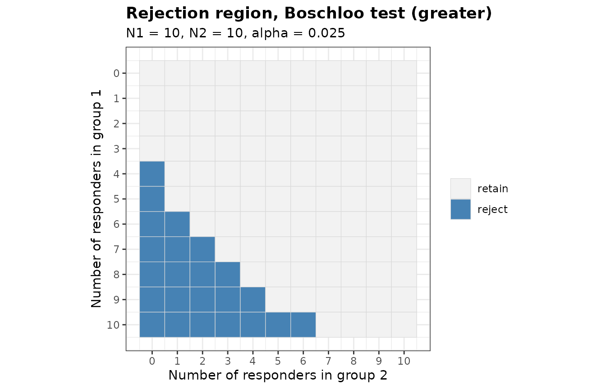
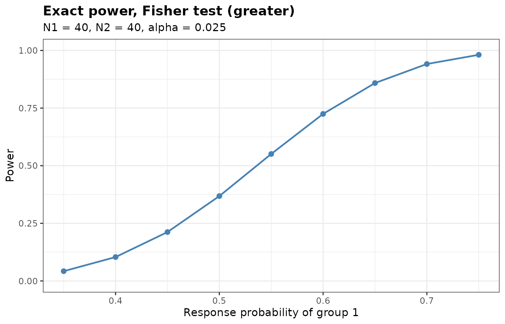
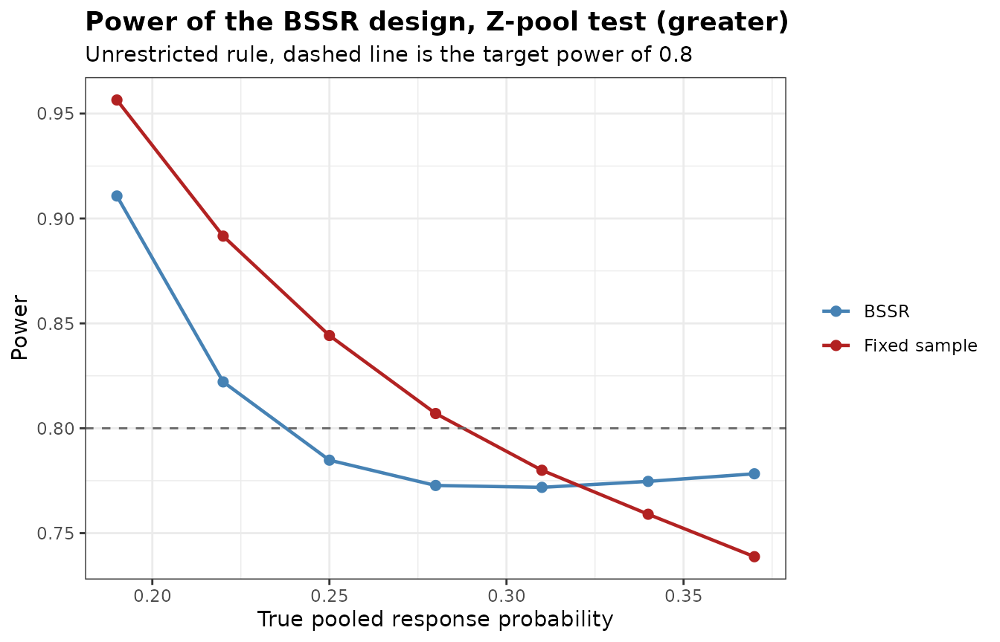

# Introduction to bbssr

``` r

library(bbssr)
```

## What the package does

A trial with a binary endpoint needs an assumed response probability in
each group before the first patient is enrolled. If the pooled response
probability turns out to differ from what was assumed, the trial ends up
either underpowered or larger than it needed to be. Blinded sample size
re-estimation addresses this by looking at the pooled number of
responders partway through the trial and adjusting the remaining
enrolment, without ever splitting the data by treatment group.

The package covers the whole chain of calculations that this requires.
Everything rests on
[`BinaryRR()`](https://gosukehommaex.github.io/bbssr/reference/BinaryRR.md),
which returns the rejection region of a test over the grid of possible
outcomes.
[`BinaryPower()`](https://gosukehommaex.github.io/bbssr/reference/BinaryPower.md)
sums the binomial probability mass over that region,
[`BinarySampleSize()`](https://gosukehommaex.github.io/bbssr/reference/BinarySampleSize.md)
searches, from the normal approximation, for the sample size at which
the exact power first attains a target,
[`BinaryPowerBSSR()`](https://gosukehommaex.github.io/bbssr/reference/BinaryPowerBSSR.md)
averages the power over the distribution of the interim data, and
[`BinaryBSSR()`](https://gosukehommaex.github.io/bbssr/reference/BinaryBSSR.md)
applies the re-estimation to a single observed interim data set.
[`BinaryTypeIErrorBSSR()`](https://gosukehommaex.github.io/bbssr/reference/BinaryTypeIErrorBSSR.md)
evaluates the type I error rate of a re-estimation design over the
nuisance parameter,
[`BinaryAlphaAdjBSSR()`](https://gosukehommaex.github.io/bbssr/reference/BinaryAlphaAdjBSSR.md)
lowers the nominal level until that rate is controlled, and
[`BinaryCondRejectBSSR()`](https://gosukehommaex.github.io/bbssr/reference/BinaryCondRejectBSSR.md)
decomposes the rate by the interim outcome.
[`BinaryGridBSSR()`](https://gosukehommaex.github.io/bbssr/reference/BinaryGridBSSR.md)
evaluates several designs over common scenarios and returns one data
frame.

## The seven tests

``` r

tests <- c('Chisq', 'Fisher', 'Fisher-midP', 'Z-pool', 'Boschloo')
```

`Chisq` is the Pearson chi-squared test without a continuity correction.
`Fisher` is the Fisher exact test and `Fisher-midP` its mid-p variant.
`Z-pool` and `Boschloo` are exact unconditional tests, which remove the
nuisance parameter by maximizing the null tail probability over the
common response probability rather than by conditioning on the total
number of responders. `Blackwelder` and `Farrington-Manning` are the
tests of non-inferiority of Blackwelder (1982) and of Farrington and
Manning (1990), which take a margin on the scale of the risk difference
through the argument `margin`. With `margin = 0` they are tests of
superiority, and the Farrington-Manning test then coincides with
`Chisq`. The `bbssr-non-inferiority` vignette covers these two tests,
and the comparisons below use the other five.

Only `Fisher`, `Z-pool` and `Boschloo` keep the type I error rate of a
fixed-sample design at or below the nominal level for every value of the
nuisance parameter. For the two unconditional tests this holds up to the
search over a grid of the nuisance parameter, which `ref.pvalue = TRUE`
refines. The two unconditional tests are slower to compute than Fisher’s
test and usually more powerful. The chi-squared and mid-p tests do not
carry the guarantee.

## Rejection regions

``` r

RR <- BinaryRR(N1 = 10, N2 = 10, alpha = 0.025, Test = 'Boschloo')
RR
#> Rejection region for a two-arm trial with a binary endpoint
#> 
#>   Test          : Boschloo
#>   Alternative   : greater
#>   Sample sizes  : N1 = 10, N2 = 10
#>   Alpha         : 0.025
#>   Grid points   : 100
#>   Berger-Boos   : not used
#>   Refinement    : not used
#> 
#>   Rejected outcomes: 23 of 121
#> 
#>       x2=0 x2=1 x2=2 x2=3 x2=4 x2=5 x2=6 x2=7 x2=8 x2=9 x2=10
#> x1=0  .    .    .    .    .    .    .    .    .    .    .    
#> x1=1  .    .    .    .    .    .    .    .    .    .    .    
#> x1=2  .    .    .    .    .    .    .    .    .    .    .    
#> x1=3  .    .    .    .    .    .    .    .    .    .    .    
#> x1=4  X    .    .    .    .    .    .    .    .    .    .    
#> x1=5  X    .    .    .    .    .    .    .    .    .    .    
#> x1=6  X    X    .    .    .    .    .    .    .    .    .    
#> x1=7  X    X    X    .    .    .    .    .    .    .    .    
#> x1=8  X    X    X    X    .    .    .    .    .    .    .    
#> x1=9  X    X    X    X    X    .    .    .    .    .    .    
#> x1=10 X    X    X    X    X    X    X    .    .    .    .    
#> 
#>   X marks rejection of the null hypothesis
```

``` r

plot(RR)
```



The region is monotone: more responders in group 1, or fewer in group 2,
can only move an outcome into the rejection region. Without the
Berger-Boos procedure the Boschloo p-value never exceeds the Fisher
p-value, so the Boschloo region always contains the Fisher region.

``` r

n_rejected <- vapply(tests, function(tst) {
  sum(BinaryRR(10, 10, 0.025, tst))
}, numeric(1))
n_rejected
#>       Chisq      Fisher Fisher-midP      Z-pool    Boschloo 
#>          23          17          23          23          23
```

## Power and sample size

``` r

BinaryPower(p1 = 0.6, p2 = 0.3, N1 = 40, N2 = 40, alpha = 0.025, Test = 'Fisher')
#> Exact power for a two-arm trial with a binary endpoint
#> 
#>   Test         : Fisher
#>   Alternative  : greater
#>   Sample sizes : N1 = 40, N2 = 40
#>   Alpha        : 0.025
#> 
#>   p1  p2  Power
#>  0.6 0.3 0.7248
```

``` r

pw <- BinaryPower(p1 = seq(0.35, 0.75, by = 0.05), p2 = rep(0.3, 9),
                  N1 = 40, N2 = 40, alpha = 0.025, Test = 'Fisher')
plot(pw)
```



``` r

ss <- BinarySampleSize(p1 = 0.6, p2 = 0.3, r = 1, alpha = 0.025,
                       tar.power = 0.8, Test = 'Fisher')
ss
#> Sample size for a two-arm trial with a binary endpoint
#> 
#>   Test             : Fisher
#>   Alternative      : greater
#>   Response rates   : p1 = 0.6, p2 = 0.3
#>   Allocation ratio : 1 to 1
#>   Alpha            : 0.025
#>   Target power     : 0.8
#> 
#>   Required sample size: N1 = 48, N2 = 48, total N = 96
#>   Attained power      : 0.8005
```

The exact power is not monotone in the sample size. Adding one patient
changes the set of attainable significance levels, and the largest level
below alpha can fall rather than rise. The following table shows the
effect around the selected sample size.

``` r

n2 <- (ss$N2 - 6):(ss$N2 + 5)
data.frame(
  N2 = n2,
  Power = round(vapply(n2, function(n) {
    BinaryPower(0.6, 0.3, n, n, 0.025, 'Fisher')$Power
  }, numeric(1)), 4)
)
#>    N2  Power
#> 1  42 0.7638
#> 2  43 0.7373
#> 3  44 0.7417
#> 4  45 0.7575
#> 5  46 0.7697
#> 6  47 0.7858
#> 7  48 0.8005
#> 8  49 0.8152
#> 9  50 0.8290
#> 10 51 0.8419
#> 11 52 0.8540
#> 12 53 0.8361
```

This is why the sample size search evaluates the exact power at every
candidate it visits rather than inverting a smooth approximation.

## Blinded sample size re-estimation

Consider a trial designed for a response probability of 0.45 in group 1
and 0.09 in group 2, so an assumed treatment effect of 0.36 and a pooled
probability of 0.27.

The variance of a binary endpoint is largest at one half, so at a fixed
risk difference the required sample size grows as the pooled probability
approaches that value. A trial sized at a pooled probability of 0.27 is
therefore over-powered if the true value turns out lower, and
under-powered if it turns out higher.

``` r

plan <- BinarySampleSize(p1 = 0.45, p2 = 0.09, r = 1, alpha = 0.025,
                         tar.power = 0.8, Test = 'Z-pool')
plan
#> Sample size for a two-arm trial with a binary endpoint
#> 
#>   Test             : Z-pool
#>   Alternative      : greater
#>   Response rates   : p1 = 0.45, p2 = 0.09
#>   Allocation ratio : 1 to 1
#>   Alpha            : 0.025
#>   Target power     : 0.8
#> 
#>   Required sample size: N1 = 24, N2 = 24, total N = 48
#>   Attained power      : 0.8182
```

[`BinaryPowerBSSR()`](https://gosukehommaex.github.io/bbssr/reference/BinaryPowerBSSR.md)
traces both effects. The scenarios below run from a pooled probability
of 0.19 up to 0.37, with the design fixed at the sample size above.

``` r

res <- BinaryPowerBSSR(
  p = seq(0.19, 0.37, by = 0.03),
  Delta.A = 0.36, Delta.T = 0.36,
  N1 = plan$N1, N2 = plan$N2, omega = 0.5, r = 1,
  alpha = 0.025, tar.power = 0.8, Test = 'Z-pool'
)
res
#> Blinded sample size re-estimation for a binary endpoint
#> 
#>   Test            : Z-pool
#>   Alternative     : greater
#>   Design rule     : unrestricted
#>   Initial size    : N1 = 24, N2 = 24
#>   Interim fraction: 0.5, giving n1 = 12 and n2 = 12
#>   Treatment effect: assumed 0.36, true 0.36 (risk difference)
#>   Re-estimation   : exact power of Z-pool at level 0.025
#>   Alpha           : 0.025, target power 0.8
#> 
#>     p   p1   p2 power.BSSR power.TRAD  E.N
#>  0.19 0.37 0.01     0.9107     0.9565 38.2
#>  0.22 0.40 0.04     0.8221     0.8916 40.6
#>  0.25 0.43 0.07     0.7848     0.8442 43.5
#>  0.28 0.46 0.10     0.7727     0.8070 46.6
#>  0.31 0.49 0.13     0.7718     0.7800 49.4
#>  0.34 0.52 0.16     0.7747     0.7590 51.9
#>  0.37 0.55 0.19     0.7783     0.7388 53.9
```

``` r

plot(res)
```



The `power.TRAD` column falls steadily as the pooled probability rises,
from well above the target at the low end to well below it at the high
end. The `power.BSSR` column stays nearer the target at both ends, since
the re-estimation removes patients in the first case and adds them in
the second. Away from the low end it lies a little below the target. The
`E.N` column shows the expected total sample size that the re-estimation
settles on, against the 48 patients of the fixed design. `summary(res)`
adds the standard deviation and the quartiles of the final total sample
size.

## Restricted and unrestricted rules

Under the unrestricted rule the trial may end up smaller than planned
when the interim data suggest that fewer patients suffice. Under the
restricted rule the planned sample size acts as a floor, so the trial
can only grow.

``` r

args <- list(
  p = seq(0.19, 0.37, by = 0.06),
  Delta.A = 0.36, Delta.T = 0.36, N1 = plan$N1, N2 = plan$N2, omega = 0.5, r = 1,
  alpha = 0.025, tar.power = 0.8, Test = 'Chisq'
)
unrestricted <- do.call(BinaryPowerBSSR, c(args, list(restricted = FALSE)))
restricted <- do.call(BinaryPowerBSSR, c(args, list(restricted = TRUE)))
data.frame(
  p = unrestricted$p,
  power.unrestricted = round(unrestricted$power.BSSR, 4),
  power.restricted = round(restricted$power.BSSR, 4),
  EN.unrestricted = round(unrestricted$E.N, 1),
  EN.restricted = round(restricted$E.N, 1)
)
#>      p power.unrestricted power.restricted EN.unrestricted EN.restricted
#> 1 0.19             0.9113           0.9737            36.8          48.2
#> 2 0.25             0.7786           0.8808            41.0          49.0
#> 3 0.31             0.7636           0.8224            46.7          50.9
#> 4 0.37             0.7739           0.7970            51.9          53.6
```

For any single interim outcome that calls for more patients than planned
the two rules give the same answer, since neither caps the increase.
They part company when the interim outcome calls for fewer. The columns
above are expectations over all interim outcomes, so they converge
rather than coincide as the pooled probability rises. The unrestricted
rule takes the saving and ends with a smaller expected trial. The
restricted rule keeps at least the planned sample size, which costs
patients but never leaves the trial smaller than what the protocol
promised.

## Re-estimating from observed interim data

The functions above describe a design before the trial starts. Once the
trial is running, the interim analysis produces one number that can be
shared without unblinding, namely the total count of responders.
[`BinaryBSSR()`](https://gosukehommaex.github.io/bbssr/reference/BinaryBSSR.md)
turns that number into an enrolment decision.

``` r

interim <- BinaryBSSR(n1 = ceiling(plan$N1 / 2), n2 = ceiling(plan$N2 / 2), S = 8,
                      Delta.A = 0.36, r = 1, alpha = 0.025, tar.power = 0.8,
                      Test = 'Z-pool')
interim
#> Blinded sample size re-estimation from interim data
#> 
#>   Test             : Z-pool
#>   Alternative      : greater
#>   Design rule      : unrestricted
#>   Assumed effect   : 0.36
#>   Alpha            : 0.025, target power 0.8
#> 
#> Interim data
#>   Patients         : n1 = 12, n2 = 12, total n = 24
#>   Responders       : S = 8, blinded pooled rate = 0.3333
#>   Recovered rates  : hat.p1 = 0.5133, hat.p2 = 0.1533
#> 
#> Re-estimation
#>   Required total   : N1 = 27, N2 = 27, total N = 54
#>   Still to enrol   : group 1 = 15, group 2 = 15, total = 30
#>   Final size       : N1 = 27, N2 = 27, total N = 54
#>   Power at final N : 0.8129
```

The interim analysis sits at half of the planned 24 patients per group.
With 8 responders among 24 patients the blinded pooled rate is 0.333,
against the assumed 0.27, and the re-estimated total is 54 patients
against the 48 of the plan. The `bbssr-interim-reestimation` vignette
works through this in more detail.

## Two-sided tests

Every test accepts `alternative = 'two.sided'`. For the conditional
tests, and for the Boschloo test, whose ordering statistic is the Fisher
p-value, the two-sided p-value follows one of two conventions, selected
with `tsmethod`.

``` r

pw <- function(alpha, alternative, tsmethod = 'minlike') {
  BinaryPower(0.6, 0.3, 40, 40, alpha, 'Fisher',
              alternative = alternative, tsmethod = tsmethod)$Power
}
round(c(
  one.sided.alpha.0.025 = pw(0.025, 'greater'),
  two.sided.alpha.0.025.minlike = pw(0.025, 'two.sided', 'minlike'),
  two.sided.alpha.0.025.central = pw(0.025, 'two.sided', 'central'),
  two.sided.alpha.0.05.minlike = pw(0.05, 'two.sided', 'minlike'),
  two.sided.alpha.0.05.central = pw(0.05, 'two.sided', 'central')
), 4)
#>         one.sided.alpha.0.025 two.sided.alpha.0.025.minlike 
#>                        0.7248                        0.6419 
#> two.sided.alpha.0.025.central  two.sided.alpha.0.05.minlike 
#>                        0.6419                        0.7248 
#>  two.sided.alpha.0.05.central 
#>                        0.7248
```

At the same nominal level the two-sided test is the less powerful, since
half of the level is spent on a direction the alternative does not point
in. At twice the level it comes back to the one-sided test, because the
lower tail contributes almost nothing to the power when the true effect
is positive. With equal group sizes the conditional distribution of the
responder count of group 1 is symmetric, so the two conventions give the
same power here. With unequal group sizes they can differ, as the
`bbssr-statistical-methods` vignette shows.

The alternative `'less'`, under which group 1 has the lower response
probability, is obtained by exchanging the two groups, so it gives the
same power as `'greater'` with the groups exchanged.

``` r

c(greater = BinaryPower(0.6, 0.3, 40, 40, 0.025, 'Fisher')$Power,
  less = BinaryPower(0.3, 0.6, 40, 40, 0.025, 'Fisher', alternative = 'less')$Power)
#>  greater     less 
#> 0.724766 0.724766
```

The `bbssr-statistical-methods` vignette explains the two conventions
and the Berger-Boos procedure for the unconditional tests.

## Type I error rate of a re-estimation design

A test that keeps the nominal level at a fixed sample size need not keep
it once the sample size depends on the interim data.
[`BinaryTypeIErrorBSSR()`](https://gosukehommaex.github.io/bbssr/reference/BinaryTypeIErrorBSSR.md)
evaluates the rejection probability of the design above under equal
response probabilities, over a grid of the common value, and refines the
largest local maxima.

``` r

tie <- BinaryTypeIErrorBSSR(
  Delta.A = 0.36, N1 = plan$N1, N2 = plan$N2, omega = 0.5, r = 1,
  alpha = 0.025, tar.power = 0.8, Test = 'Z-pool'
)
tie
#> Type I error rate of blinded sample size re-estimation for a binary endpoint
#> 
#>   Test            : Z-pool
#>   Alternative     : greater
#>   Initial size    : N1 = 24, N2 = 24
#>   Interim size    : n1 = 12, n2 = 12
#>   Assumed effect  : 0.36 (RD)
#>   Nominal level   : 0.025
#>   Grid            : 201 values of theta in [0, 1]
#>   Maximum         : certified over theta in [0, 1]
#> 
#> Largest type I error rate
#>        Design    theta     TIE
#>          BSSR 0.145958 0.02499
#>  Fixed sample 0.646877 0.02203
```

The `bbssr-type1-error` vignette explains this output and shows how
[`BinaryAlphaAdjBSSR()`](https://gosukehommaex.github.io/bbssr/reference/BinaryAlphaAdjBSSR.md)
lowers the nominal level when the rate exceeds it.

## Where to go next

- `bbssr-interim-reestimation` follows a single trial from planning to
  the interim decision.
- `bbssr-reestimation-rules` covers the options of the re-estimation:
  the normal approximation, the rounding rules, bounds on the final
  sample size and the risk ratio and odds ratio.
- `bbssr-design-grid` compares several designs with
  [`BinaryGridBSSR()`](https://gosukehommaex.github.io/bbssr/reference/BinaryGridBSSR.md).
- `bbssr-non-inferiority` covers the tests with a margin and the
  re-estimation in non-inferiority trials.
- `bbssr-type1-error` covers the type I error rate, the adjusted level
  and the conditional rejection probabilities.
- `bbssr-statistical-methods` derives the tests and the re-estimation.
- `bbssr-validation` compares the package with `stats`, `Exact`,
  `exact2x2` and published results, and reports timings.

## References

Blackwelder, W. C. (1982). “Proving the null hypothesis” in clinical
trials. *Controlled Clinical Trials*, 3, 345-353.

Farrington, C. P. and Manning, G. (1990). Test statistics and sample
size formulae for comparative binomial trials with null hypothesis of
non-zero risk difference or non-unity relative risk. *Statistics in
Medicine*, 9, 1447-1454.
