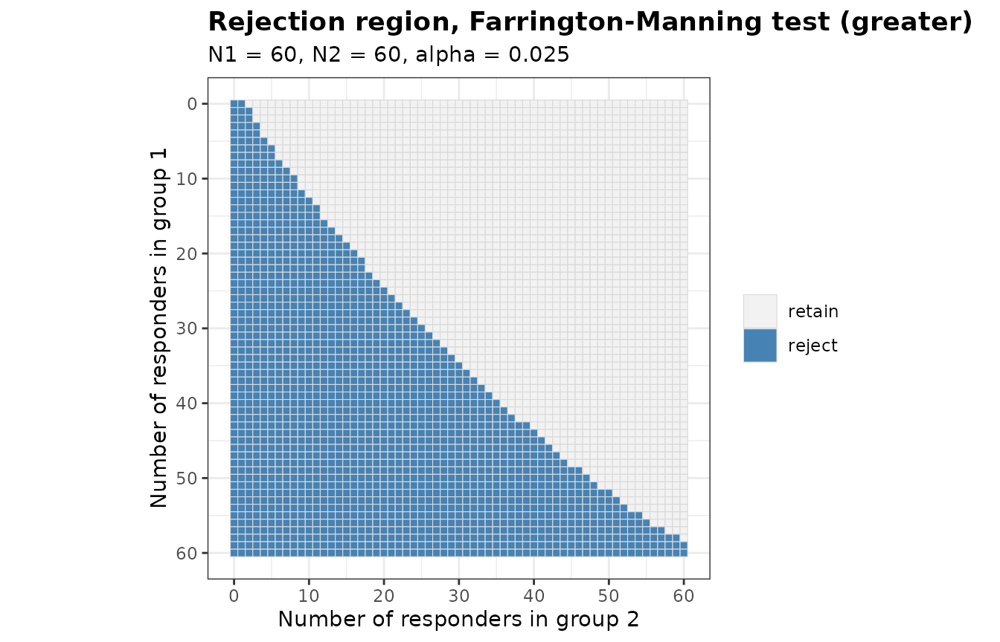
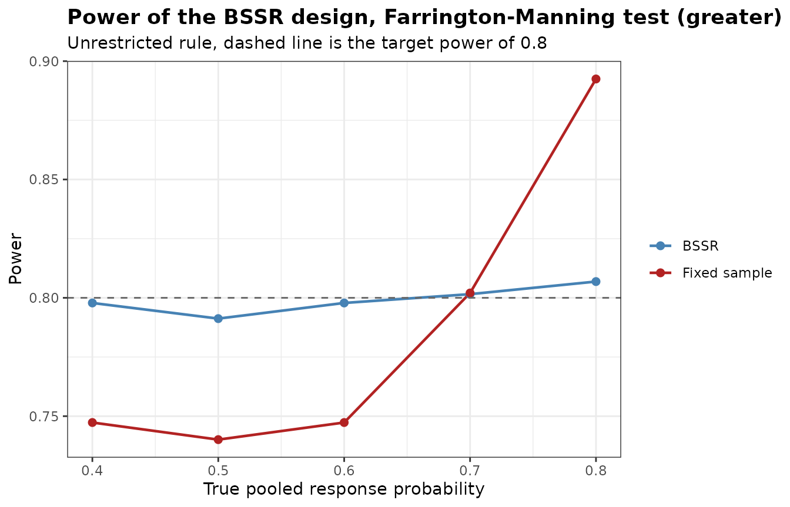
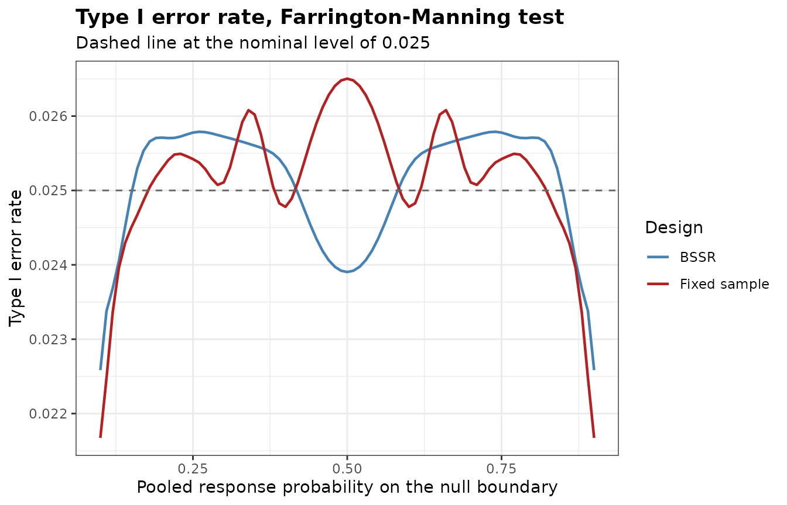
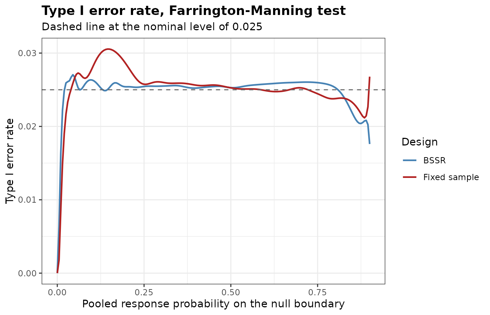

# Non-inferiority Trials

``` r

library(bbssr)
```

## Hypotheses and margin

Let group 1 receive the experimental treatment and group 2 the control.
A non-inferiority trial with a margin $`\delta > 0`$ on the scale of the
risk difference tests
``` math
H_{0}: p_{1} - p_{2} \le -\delta \quad \text{against} \quad H_{1}: p_{1} - p_{2} > -\delta ,
```
which corresponds to `alternative = 'greater'` and `margin = delta`.
With `alternative = 'less'` the null hypothesis is
$`p_{1} - p_{2} \ge \delta`$, which suits an endpoint for which a lower
response probability is better. A negative margin tests superiority by
more than its absolute value. A margin other than 0 requires one of the
two tests below and a one-sided alternative. The last section covers a
margin on the scale of the risk ratio, `margin.scale = 'RR'`.

## The two tests

Both tests refer
``` math
Z = \frac{\hat{p}_{1} - \hat{p}_{2} + \delta}{\widehat{\mathrm{SE}}}
```
to the standard normal distribution and reject $`H_{0}`$ when
$`Z > z_{1 - \alpha}`$. The test of Blackwelder (1982),
`Test = 'Blackwelder'`, uses the standard error at the observed
proportions,
``` math
\widehat{\mathrm{SE}} = \sqrt{\frac{\hat{p}_{1}(1 - \hat{p}_{1})}{N_{1}} + \frac{\hat{p}_{2}(1 - \hat{p}_{2})}{N_{2}}} .
```
The test of Farrington and Manning (1990),
`Test = 'Farrington-Manning'`, uses the same expression at the maximum
likelihood estimates $`\tilde{p}_{1}`$ and $`\tilde{p}_{2}`$ under the
restriction $`p_{1} - p_{2} = -\delta`$. With $`\delta = 0`$ the
Farrington-Manning test is the chi-squared test and the Blackwelder test
is the Wald test.

The two tests are asymptotic, but the package computes their rejection
regions, power and sample sizes exactly, as for the other tests.

``` r

rr.bw <- BinaryRR(N1 = 60, N2 = 60, alpha = 0.025, Test = 'Blackwelder', margin = 0.1)
rr.fm <- BinaryRR(N1 = 60, N2 = 60, alpha = 0.025, Test = 'Farrington-Manning',
                  margin = 0.1)
c(Blackwelder = sum(rr.bw), Farrington.Manning = sum(rr.fm))
#>        Blackwelder Farrington.Manning 
#>               1714               1698
plot(rr.fm)
```



The size of a test of non-inferiority is its largest rejection
probability on the boundary $`p_{1} = p_{2} - \delta`$ of the null
hypothesis. The function below evaluates it over a fine grid of
$`p_{2}`$.

``` r

boundary_size <- function(RR, margin) {
  N1 <- attr(RR, 'N1')
  N2 <- attr(RR, 'N2')
  m <- matrix(as.vector(RR), N1 + 1L, N2 + 1L)
  p2 <- seq(margin + 0.001, 0.999, by = 0.001)
  size <- vapply(p2, function(q) {
    sum(outer(dbinom(0:N1, N1, q - margin), dbinom(0:N2, N2, q)) * m)
  }, numeric(1))
  data.frame(p2 = p2[which.max(size)], size = max(size))
}
sizes <- cbind(Test = c('Blackwelder', 'Farrington-Manning'),
               rbind(boundary_size(rr.bw, 0.1), boundary_size(rr.fm, 0.1)))
sizes
#>                 Test    p2       size
#> 1        Blackwelder 0.993 0.06067597
#> 2 Farrington-Manning 0.550 0.02730085
```

The nominal level is 0.025. With 60 patients per group the size is
0.0607 for the Blackwelder test, attained at $`p_{2} =`$ 0.993, and
0.0273 for the Farrington-Manning test. The size of an asymptotic test
at a given sample size can lie on either side of the nominal level, so
it is worth computing for the sample sizes of a design.

## Sample size

With a margin,
[`BinarySampleSize()`](https://gosukehommaex.github.io/bbssr/reference/BinarySampleSize.md)
replaces the difference in the normal approximation by its distance
$`p_{1} - p_{2} + \delta`$ from the boundary of the null hypothesis.
`method = 'standard'` evaluates the variance in the term of the
significance level at the large sample values of the restricted
estimates, which gives formula (4) of Farrington and Manning (1990).
`method = 'alternative.variance'` uses the variance under the
alternative in both terms, which gives the formula of Blackwelder
(1982). `method = 'exact'` steps from the formula of Farrington and
Manning, one patient at a time, to the sample size at which the exact
power of the test first attains the target. Below, both groups have a
response probability of 0.7 and the margin is 0.15.

``` r

ni.ss <- expand.grid(method = c('exact', 'standard', 'alternative.variance'),
                     Test = c('Blackwelder', 'Farrington-Manning'),
                     stringsAsFactors = FALSE)
ni.ss$N <- NA
ni.ss$Power <- NA
for (i in seq_len(nrow(ni.ss))) {
  ss <- BinarySampleSize(p1 = 0.7, p2 = 0.7, r = 1, alpha = 0.025, tar.power = 0.8,
                         Test = ni.ss$Test[i], method = ni.ss$method[i], margin = 0.15)
  ni.ss$N[i] <- ss$N
  ni.ss$Power[i] <- round(ss$Power, 4)
}
ni.ss
#>                 method               Test   N  Power
#> 1                exact        Blackwelder 292 0.8009
#> 2             standard        Blackwelder 292 0.8009
#> 3 alternative.variance        Blackwelder 294 0.8024
#> 4                exact Farrington-Manning 290 0.8005
#> 5             standard Farrington-Manning 292 0.8020
#> 6 alternative.variance Farrington-Manning 294 0.8062
```

`Power` is the exact power of the test at the sample size of each row,
so the rows of the two formulas show how close the normal approximation
comes to the target for each test.

## Blinded sample size re-estimation

Friede, Mitchell and Mueller-Velten (2007) re-estimate the sample size
of a non-inferiority trial from the blinded overall response rate, which
is the pooled response probability of the package. The assumed
difference is usually 0, so both recovered probabilities equal the
blinded pooled response probability, and the sample size is re-estimated
by the formula of Farrington and Manning (`ss.method = 'standard'`) or
of Blackwelder (`ss.method = 'alternative.variance'`). The design below
is planned for a pooled response probability of 0.7 and re-estimates the
sample size after half of the patients.

``` r

plan <- BinarySampleSize(p1 = 0.7, p2 = 0.7, r = 1, alpha = 0.025, tar.power = 0.8,
                         Test = 'Farrington-Manning', method = 'standard', margin = 0.15)
ni <- BinaryPowerBSSR(
  p = seq(0.4, 0.8, by = 0.1), Delta.A = 0, Delta.T = 0,
  N1 = plan$N1, N2 = plan$N2, omega = 0.5, r = 1, alpha = 0.025, tar.power = 0.8,
  Test = 'Farrington-Manning', ss.method = 'standard', margin = 0.15
)
ni
#> Blinded sample size re-estimation for a binary endpoint
#> 
#>   Test            : Farrington-Manning
#>   Alternative     : greater
#>   Design rule     : unrestricted
#>   Initial size    : N1 = 146, N2 = 146
#>   Interim fraction: 0.5, giving n1 = 73 and n2 = 73
#>   Treatment effect: assumed 0, true 0 (risk difference)
#>   Margin          : 0.15
#>   Re-estimation   : normal approximation (standard), group rounding at level 0.025
#>   Alpha           : 0.025, target power 0.8
#> 
#>    p  p1  p2 power.BSSR power.TRAD   E.N
#>  0.4 0.4 0.4     0.7978     0.7473 329.0
#>  0.5 0.5 0.5     0.7912     0.7401 342.1
#>  0.6 0.6 0.6     0.7978     0.7473 329.0
#>  0.7 0.7 0.7     0.8015     0.8020 290.8
#>  0.8 0.8 0.8     0.8069     0.8925 228.5
plot(ni)
```



``` r

summary(ni)
#>    p1  p2   p      E.N      SD.N N.q25 N.q50 N.q75      P.N.max
#> 1 0.4 0.4 0.4 328.9911 10.868511   322   330   336 4.408925e-02
#> 2 0.5 0.5 0.5 342.0553  3.210567   342   344   344 5.435178e-01
#> 3 0.6 0.6 0.6 328.9911 10.868511   322   330   336 4.408925e-02
#> 4 0.7 0.7 0.7 290.7938 19.451117   278   294   304 8.652446e-06
#> 5 0.8 0.8 0.8 228.4956 24.167543   212   228   244 1.323903e-13
```

The planned total sample size is 292. The variance of a binary endpoint
is largest at one half, so the fixed-sample design loses power when the
true pooled response probability lies closer to one half than the
planning value, and the re-estimation enlarges the trial in that case.
At a pooled response probability of 0.4 the power is 0.798 with
re-estimation and 0.747 without.

## Type I error rate on the boundary

With a margin,
[`BinaryTypeIErrorBSSR()`](https://gosukehommaex.github.io/bbssr/reference/BinaryTypeIErrorBSSR.md)
evaluates the type I error rate on the boundary of the null hypothesis.
The boundary is parametrized by the pooled response probability `theta`,
and the values at which a response probability falls outside the unit
interval are dropped.

``` r

ni.tie <- BinaryTypeIErrorBSSR(
  Delta.A = 0, N1 = plan$N1, N2 = plan$N2, omega = 0.5, r = 1, alpha = 0.025,
  tar.power = 0.8, Test = 'Farrington-Manning', ss.method = 'standard', margin = 0.15,
  theta = seq(0.1, 0.9, by = 0.01)
)
ni.tie
#> Type I error rate of blinded sample size re-estimation for a binary endpoint
#> 
#>   Test            : Farrington-Manning
#>   Alternative     : greater
#>   Initial size    : N1 = 146, N2 = 146
#>   Interim size    : n1 = 73, n2 = 73
#>   Assumed effect  : 0 (RD)
#>   Margin          : 0.15
#>   Nominal level   : 0.025
#>   Grid            : 81 values of theta in [0.1, 0.9]
#>   Maximum         : certified over theta in [0.1, 0.9]
#> 
#> Largest type I error rate
#>        Design    theta     TIE
#>          BSSR 0.261652 0.02579
#>  Fixed sample 0.500000 0.02650
plot(ni.tie)
```



The largest type I error rate is certified over the interval spanned by
`theta`, here from 0.1 to 0.9. With the default
`theta = seq(0, 1, by = 0.005)` the interval is the whole part of the
boundary on which both response probabilities lie in the unit interval,
which with an allocation ratio of 1 is `theta` from $`\delta / 2`$ to
$`1 - \delta / 2`$.

The same rejection probabilities follow from
[`BinaryPowerBSSR()`](https://gosukehommaex.github.io/bbssr/reference/BinaryPowerBSSR.md)
with the true difference on the boundary, `Delta.T = -margin`.

``` r

on.boundary <- BinaryPowerBSSR(
  p = c(0.5, 0.7), Delta.A = 0, Delta.T = -0.15,
  N1 = plan$N1, N2 = plan$N2, omega = 0.5, r = 1, alpha = 0.025, tar.power = 0.8,
  Test = 'Farrington-Manning', ss.method = 'standard', margin = 0.15
)
rows <- vapply(c(0.5, 0.7), function(t) which.min(abs(ni.tie$theta - t)), integer(1))
max(abs(on.boundary$power.BSSR - ni.tie$TIE.BSSR[rows]))
#> [1] 0
```

[`BinaryAlphaAdjBSSR()`](https://gosukehommaex.github.io/bbssr/reference/BinaryAlphaAdjBSSR.md)
accepts the margin in the same way and adjusts the nominal level on the
boundary.

## Margin on the scale of the risk ratio

With `margin.scale = 'RR'` the margin is a ratio $`R_{0} > 0`$, and
`alternative = 'greater'` tests
``` math
H_{0}: p_{1} / p_{2} \le R_{0} \quad \text{against} \quad H_{1}: p_{1} / p_{2} > R_{0} .
```
With `alternative = 'less'` the null hypothesis is
$`p_{1} / p_{2} \ge R_{0}`$, as in the second example of Farrington and
Manning (1990), where the relative risk of pertussis among recipients of
an acellular vaccine compared with those of a whole cell vaccine is to
be shown to be below 1.5. A margin on this scale also requires one of
the two tests and a one-sided alternative, and in the functions with
re-estimation the assumed and the true effects are then risk ratios
(`effect = 'RR'`).

Both tests refer statistic (5) of Farrington and Manning (1990),
``` math
Z = \frac{\hat{p}_{1} - R_{0} \hat{p}_{2}}{\widehat{\mathrm{SE}}} , \qquad
\widehat{\mathrm{SE}}^{2} = \frac{\tilde{p}_{1}(1 - \tilde{p}_{1})}{N_{1}} + R_{0}^{2} \frac{\tilde{p}_{2}(1 - \tilde{p}_{2})}{N_{2}} ,
```
to the standard normal distribution. The Blackwelder test takes
$`\tilde{p}_{1} = \hat{p}_{1}`$ and $`\tilde{p}_{2} = \hat{p}_{2}`$,
which is Method 1 of the article. The Farrington-Manning test takes the
maximum likelihood estimates under the restriction
$`p_{1} = R_{0} p_{2}`$. With $`\theta = N_{2} / N_{1}`$, the estimate
$`\tilde{p}_{1}`$ is the smaller root of
``` math
(1 + \theta) x^{2} - \{R_{0}(1 + \theta \hat{p}_{2}) + \theta + \hat{p}_{1}\} x + R_{0}(\hat{p}_{1} + \theta \hat{p}_{2}) = 0 ,
```
formula (13) of the article, and
$`\tilde{p}_{2} = \tilde{p}_{1} / R_{0}`$. With $`R_{0} = 1`$ the
restricted estimates are the pooled proportion, so the
Farrington-Manning test is the chi-squared test.

``` r

rr.ratio <- BinaryRR(N1 = 60, N2 = 60, alpha = 0.025, Test = 'Farrington-Manning',
                     margin = 0.8, margin.scale = 'RR')
rr.one <- BinaryRR(N1 = 60, N2 = 60, alpha = 0.025, Test = 'Farrington-Manning',
                   margin = 1, margin.scale = 'RR')
rr.chisq <- BinaryRR(N1 = 60, N2 = 60, alpha = 0.025, Test = 'Chisq')
c(ratio.0.8 = sum(rr.ratio), ratio.1 = sum(rr.one), chisq = sum(rr.chisq))
#> ratio.0.8   ratio.1     chisq 
#>      1727      1355      1355
identical(as.vector(rr.one), as.vector(rr.chisq))
#> [1] TRUE
```

[`BinarySampleSize()`](https://gosukehommaex.github.io/bbssr/reference/BinarySampleSize.md)
replaces the difference in the normal approximation by the distance
$`p_{1} - R_{0} p_{2}`$ from the boundary, or $`R_{0} p_{2} - p_{1}`$
for `alternative = 'less'`. With the allocation ratio
$`r = N_{1} / N_{2}`$ the size of group 2 is
``` math
N_{2} = \frac{\left(z_{1 - \alpha} \sqrt{v_{0}} + z_{1 - \beta} \sqrt{v_{1}}\right)^{2}}{(p_{1} - R_{0} p_{2})^{2}} , \qquad
v_{1} = \frac{p_{1}(1 - p_{1})}{r} + R_{0}^{2} p_{2}(1 - p_{2}) ,
```
where $`1 - \beta`$ is the target power and $`v_{0}`$ is the same
expression at the large sample values of the restricted estimates.
`method = 'standard'` gives formula (8) of Farrington and Manning
(1990), and `method = 'alternative.variance'`, which sets
$`v_{0} = v_{1}`$, gives the formula of their Method 1. The table below
repeats the comparison of the sample sizes for equal response
probabilities of 0.7 and the margin 0.8.

``` r

rr.ss <- expand.grid(method = c('exact', 'standard', 'alternative.variance'),
                     Test = c('Blackwelder', 'Farrington-Manning'),
                     stringsAsFactors = FALSE)
rr.ss$N <- NA
rr.ss$Power <- NA
for (i in seq_len(nrow(rr.ss))) {
  ss <- BinarySampleSize(p1 = 0.7, p2 = 0.7, r = 1, alpha = 0.025, tar.power = 0.8,
                         Test = rr.ss$Test[i], method = rr.ss$method[i], margin = 0.8,
                         margin.scale = 'RR')
  rr.ss$N[i] <- ss$N
  rr.ss$Power[i] <- round(ss$Power, 4)
}
rr.ss
#>                 method               Test   N  Power
#> 1                exact        Blackwelder 278 0.8022
#> 2             standard        Blackwelder 284 0.8085
#> 3 alternative.variance        Blackwelder 276 0.7993
#> 4                exact Farrington-Manning 282 0.8036
#> 5             standard Farrington-Manning 284 0.8047
#> 6 alternative.variance Farrington-Manning 276 0.7946
```

The second example of Farrington and Manning (1990), with
$`p_{1} = p_{2} = 0.01`$, $`R_{0} = 1.5`$, `alternative = 'less'`, the
one-sided level 0.025 and the power 0.9, needs 12,890 patients per group
by formula (8), and its true power is 90.4 per cent. The rejection
region at this sample size has more than $`1.6 \times 10^{8}`$ outcomes,
so `inst/reproduce/reproduce-published.R` sums the exact power over the
outcomes that carry the probability, and reproduces both values together
with Tables I and II of the article.

The re-estimation of Friede, Mitchell and Mueller-Velten (2007) carries
over with the assumed ratio `Delta.A = 1`, which recovers the pooled
proportion for both groups. The design below is planned for a pooled
response probability of 0.7, re-estimates the sample size by formula (8)
after half of the patients, and allows at most twice the planned sample
size.

``` r

plan.rr <- BinarySampleSize(p1 = 0.7, p2 = 0.7, r = 1, alpha = 0.025, tar.power = 0.8,
                            Test = 'Farrington-Manning', method = 'standard',
                            margin = 0.8, margin.scale = 'RR')
ni.rr <- BinaryPowerBSSR(
  p = seq(0.4, 0.8, by = 0.1), Delta.A = 1, Delta.T = 1,
  N1 = plan.rr$N1, N2 = plan.rr$N2, omega = 0.5, r = 1, alpha = 0.025, tar.power = 0.8,
  Test = 'Farrington-Manning', effect = 'RR', ss.method = 'standard',
  N.max = 2 * plan.rr$N, margin = 0.8, margin.scale = 'RR'
)
ni.rr
#> Blinded sample size re-estimation for a binary endpoint
#> 
#>   Test            : Farrington-Manning
#>   Alternative     : greater
#>   Design rule     : unrestricted
#>   Initial size    : N1 = 142, N2 = 142
#>   Interim fraction: 0.5, giving n1 = 71 and n2 = 71
#>   Treatment effect: assumed 1, true 1 (risk ratio)
#>   Margin          : 0.8 (risk ratio)
#>   Re-estimation   : normal approximation (standard), group rounding at level 0.025, N.max = 568
#>   Alpha           : 0.025, target power 0.8
#> 
#>    p  p1  p2 power.BSSR power.TRAD   E.N
#>  0.4 0.4 0.4     0.5812     0.3375 568.0
#>  0.5 0.5 0.5     0.7441     0.4653 555.9
#>  0.6 0.6 0.6     0.8021     0.6240 433.6
#>  0.7 0.7 0.7     0.8081     0.8047 286.5
#>  0.8 0.8 0.8     0.8212     0.9497 179.5
```

At equal response probabilities $`p`$ the distance from the boundary is
$`(1 - R_{0}) p`$, so it shrinks with $`p`$, and a lower pooled response
probability calls for more patients. The planned total sample size is
284. At a pooled response probability of 0.4 the expected total sample
size of the re-estimation design is 568.0, close to the upper bound of
568, and the power is 0.581 with re-estimation and 0.337 without.

On the boundary $`p_{1} = R_{0} p_{2}`$ the pooled response probability
is $`\theta = (1 + r R_{0}) p_{2} / (1 + r)`$, and both response
probabilities are linear in $`\theta`$, so
[`BinaryTypeIErrorBSSR()`](https://gosukehommaex.github.io/bbssr/reference/BinaryTypeIErrorBSSR.md)
certifies the largest type I error rate as on the scale of the risk
difference. With the default `theta` the interval runs from 0 to
$`\min(1, 1 / R_{0}) (1 + r R_{0}) / (1 + r)`$, at which the larger
response probability reaches 1.

``` r

tie.rr <- BinaryTypeIErrorBSSR(
  Delta.A = 1, N1 = plan.rr$N1, N2 = plan.rr$N2, omega = 0.5, r = 1, alpha = 0.025,
  tar.power = 0.8, Test = 'Farrington-Manning', effect = 'RR', ss.method = 'standard',
  N.max = 2 * plan.rr$N, margin = 0.8, margin.scale = 'RR'
)
attr(tie.rr, 'interval')
#> [1] 0.0 0.9
attr(tie.rr, 'max')
#>   Design      theta        TIE      bound
#> 1   BSSR 0.04517183 0.02704639 0.02704639
#> 2   TRAD 0.14697132 0.03055082 0.03055082
plot(tie.rr)
```



The largest type I error rate is 0.0270 for the re-estimation design, at
$`\theta =`$ 0.045, and 0.0306 for the fixed-sample design, at
$`\theta =`$ 0.147. Both exceed the nominal level of 0.025, and the
fixed-sample design exceeds it by more, so the excess comes from the
asymptotic test rather than from the re-estimation.
[`BinaryAlphaAdjBSSR()`](https://gosukehommaex.github.io/bbssr/reference/BinaryAlphaAdjBSSR.md)
accepts `margin.scale` in the same way and lowers the nominal level
until the rate is controlled.

## References

Blackwelder, W. C. (1982). “Proving the null hypothesis” in clinical
trials. *Controlled Clinical Trials*, 3, 345-353.

Farrington, C. P. and Manning, G. (1990). Test statistics and sample
size formulae for comparative binomial trials with null hypothesis of
non-zero risk difference or non-unity relative risk. *Statistics in
Medicine*, 9, 1447-1454.

Friede, T., Mitchell, C. and Mueller-Velten, G. (2007). Blinded sample
size reestimation in non-inferiority trials with binary endpoints.
*Biometrical Journal*, 49, 903-916.
