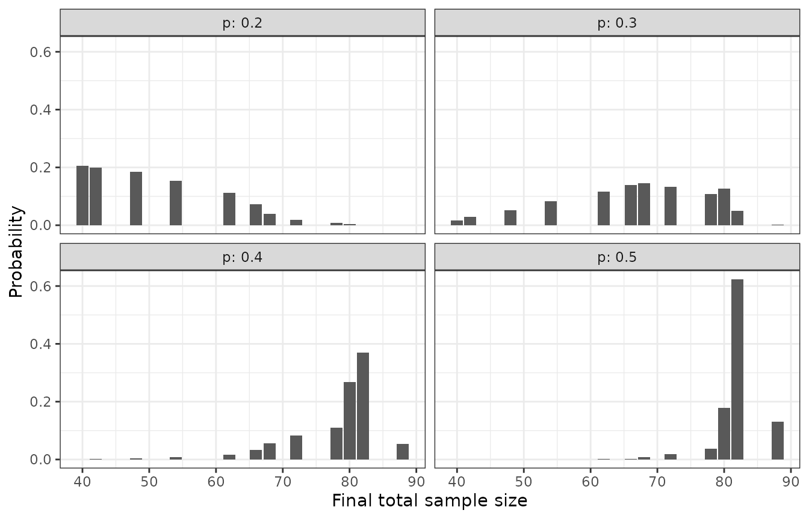

# Options of the Sample Size Re-estimation

``` r

library(bbssr)
```

## A reference design

At the interim analysis the blinded pooled response probability is split
into two group-specific probabilities with the assumed effect, and the
sample size is re-estimated from them. This vignette goes through the
arguments that control how this is done. They are shared by
[`BinaryPowerBSSR()`](https://gosukehommaex.github.io/bbssr/reference/BinaryPowerBSSR.md),
[`BinaryBSSR()`](https://gosukehommaex.github.io/bbssr/reference/BinaryBSSR.md),
[`BinaryTypeIErrorBSSR()`](https://gosukehommaex.github.io/bbssr/reference/BinaryTypeIErrorBSSR.md),
[`BinaryAlphaAdjBSSR()`](https://gosukehommaex.github.io/bbssr/reference/BinaryAlphaAdjBSSR.md),
[`BinaryCondRejectBSSR()`](https://gosukehommaex.github.io/bbssr/reference/BinaryCondRejectBSSR.md)
and
[`BinaryGridBSSR()`](https://gosukehommaex.github.io/bbssr/reference/BinaryGridBSSR.md).

The examples use a trial with an assumed risk difference of 0.3,
one-to-one allocation, a one-sided level of 0.025, a target power of 0.8
and the chi-squared test in the final analysis. The initial sample size
is planned for response probabilities of 0.5 and 0.2, and the interim
analysis takes place after half of it.

``` r

plan <- BinarySampleSize(p1 = 0.5, p2 = 0.2, r = 1, alpha = 0.025, tar.power = 0.8,
                         Test = 'Chisq')
design <- list(Delta.A = 0.3, N1 = plan$N1, N2 = plan$N2, omega = 0.5, r = 1,
               alpha = 0.025, tar.power = 0.8, Test = 'Chisq')
p.true <- seq(0.2, 0.5, by = 0.1)
plan
#> Sample size for a two-arm trial with a binary endpoint
#> 
#>   Test             : Chisq
#>   Alternative      : greater
#>   Response rates   : p1 = 0.5, p2 = 0.2
#>   Allocation ratio : 1 to 1
#>   Alpha            : 0.025
#>   Target power     : 0.8
#>   Exact search     : crossing
#> 
#>   Required sample size: N1 = 39, N2 = 39, total N = 78
#>   Attained power      : 0.8128
```

## Exact power or the normal approximation

`ss.method` selects how the sample size is re-estimated from the
recovered probabilities.

- `'exact'` (the default) steps from the normal approximation, one
  patient at a time, to the sample size at which the exact power of the
  test first attains the target, as
  [`BinarySampleSize()`](https://gosukehommaex.github.io/bbssr/reference/BinarySampleSize.md)
  does. The argument `search` replaces this search by the smallest size
  that attains the target power or by the smallest size from which every
  size up to a limit attains it, see the `bbssr-introduction` vignette.
- `'standard'` uses the normal approximation with the variance under the
  null hypothesis in the term of the significance level and the variance
  under the alternative in the term of the power, formula (21.3) of
  Kieser (2020).
- `'null.variance'` uses the variance under the null hypothesis in both
  terms, formula (1) of Friede and Kieser (2004).
- `'alternative.variance'` uses the variance under the alternative in
  both terms. With a non-inferiority margin this is the formula of
  Blackwelder (1982), see the `bbssr-non-inferiority` vignette.

The `bbssr-statistical-methods` vignette gives the formulas. The table
below shows the final total sample size that each method gives for every
fourth value of the pooled number of interim responders `s`.

``` r

methods <- c('exact', 'standard', 'null.variance')
fits <- lapply(methods, function(m) {
  do.call(BinaryPowerBSSR, c(design, list(p = p.true, Delta.T = 0.3, ss.method = m)))
})
names(fits) <- methods
final.total <- function(fit) {
  map <- attr(fit, 'reestimation')
  map$N1 + map$N2
}
map <- attr(fits$exact, 'reestimation')
by.method <- data.frame(s = map$s, hat.p = round(map$hat.p, 3),
                        hat.p1 = round(map$hat.p1, 3), hat.p2 = round(map$hat.p2, 3),
                        exact = final.total(fits$exact),
                        standard = final.total(fits$standard),
                        null.variance = final.total(fits$null.variance))
by.method[seq(1, nrow(by.method), by = 4), ]
#>     s hat.p hat.p1 hat.p2 exact standard null.variance
#> 1   0   0.0   0.15   0.00    72       40            40
#> 5   4   0.1   0.25   0.00    42       40            40
#> 9   8   0.2   0.35   0.05    48       54            56
#> 13 12   0.3   0.45   0.15    68       72            74
#> 17 16   0.4   0.55   0.25    80       82            84
#> 21 20   0.5   0.65   0.35    88       86            88
#> 25 24   0.6   0.75   0.45    80       82            84
#> 29 28   0.7   0.85   0.55    68       72            74
#> 33 32   0.8   0.95   0.65    48       54            56
#> 37 36   0.9   1.00   0.75    42       40            40
#> 41 40   1.0   1.00   0.85    72       40            40
```

The exact search uses the exact power of the chosen test, so it depends
on the test of the final analysis, whereas the two formulas do not. At
the lowest interim outcomes the recovered probability of group 2 would
be negative, and at the highest that of group 1 would exceed one. The
exact search needs probabilities inside the unit interval and truncates
them to it, which is what the columns `hat.p1` and `hat.p2` show. The
truncation shrinks the recovered difference, which is why the exact
column rises again at both ends. The formulas use the recovered
probabilities before truncation, with each Bernoulli variance truncated
at zero, so that the assumed difference is kept as in formula (2) of
Friede and Kieser (2004).

The power and the expected total sample size of the three versions are
as follows.

``` r

data.frame(
  p = p.true,
  power.exact = round(fits$exact$power.BSSR, 4),
  power.standard = round(fits$standard$power.BSSR, 4),
  power.null.variance = round(fits$null.variance$power.BSSR, 4),
  E.N.exact = round(fits$exact$E.N, 1),
  E.N.standard = round(fits$standard$E.N, 1),
  E.N.null.variance = round(fits$null.variance$E.N, 1)
)
#>     p power.exact power.standard power.null.variance E.N.exact E.N.standard
#> 1 0.2      0.7875         0.8138              0.8244      50.6         54.3
#> 2 0.3      0.7784         0.7984              0.8058      67.5         70.3
#> 3 0.4      0.7936         0.8031              0.8089      78.5         80.4
#> 4 0.5      0.8023         0.8037              0.8006      81.9         83.7
#>   E.N.null.variance
#> 1              56.3
#> 2              72.4
#> 3              82.6
#> 4              86.2
```

## Another test or level for the re-estimation

By default the sample size is re-estimated with the test and the level
of the final analysis. `ss.Test` gives another test for the exact
search, and `ss.alpha` another level. A final analysis with the Boschloo
test can, for example, re-estimate the sample size with the exact power
of the chi-squared test, which is quicker to search over. The
chi-squared test does not keep the nominal level and attains the target
power with fewer patients than the Boschloo test, so the sizes it gives
are smaller, and the power of the Boschloo test falls further below the
target, as the table shows.

``` r

boschloo <- modifyList(design, list(Test = 'Boschloo'))
fit.boschloo <- do.call(BinaryPowerBSSR, c(boschloo, list(p = p.true, Delta.T = 0.3)))
fit.chisq <- do.call(BinaryPowerBSSR,
                     c(boschloo, list(p = p.true, Delta.T = 0.3, ss.Test = 'Chisq')))
data.frame(
  p = p.true,
  power.ss.Boschloo = round(fit.boschloo$power.BSSR, 4),
  power.ss.Chisq = round(fit.chisq$power.BSSR, 4),
  E.N.ss.Boschloo = round(fit.boschloo$E.N, 1),
  E.N.ss.Chisq = round(fit.chisq$E.N, 1)
)
#>     p power.ss.Boschloo power.ss.Chisq E.N.ss.Boschloo E.N.ss.Chisq
#> 1 0.2            0.7946         0.7587            55.9         50.6
#> 2 0.3            0.7809         0.7577            71.2         67.5
#> 3 0.4            0.7943         0.7780            82.2         78.5
#> 4 0.5            0.7925         0.7617            86.5         81.9
```

`ss.alpha` matters when the final analysis uses an adjusted level.
[`BinaryAlphaAdjBSSR()`](https://gosukehommaex.github.io/bbssr/reference/BinaryAlphaAdjBSSR.md)
with `adjust = 'test'` lowers the level of the final analysis only, so
the re-estimation keeps `ss.alpha`, and with `adjust = 'both'` it lowers
both, see the `bbssr-type1-error` vignette.

## Whole numbers

The normal approximation gives an unrounded sample size, and `rounding`
turns it into whole numbers.

- `'group'` (the default) rounds up the size of group 2 and gives group
  1 `ceiling(r * N2)` patients. It is the only rule available with
  `ss.method = 'exact'`.
- `'friede-kieser'` gives the second stage the rounded-up excess of the
  unrounded total over the interim total, split into
  `ceiling(n / (1 + r))` and `ceiling(r * n / (1 + r))` patients as in
  Friede and Kieser (2004).
- `'total'` rounds up the total and gives group 2 `floor(N / (1 + r))`
  patients.
- `'nearest'` rounds each group to the nearest whole number, as in
  Farrington and Manning (1990).

With an allocation ratio of 2 to 1 the four rules give the following
final sample sizes for one interim outcome.

``` r

rounding.rules <- c('group', 'friede-kieser', 'total', 'nearest')
do.call(rbind, lapply(rounding.rules, function(rule) {
  b <- BinaryBSSR(n1 = 30, n2 = 15, S = 18, Delta.A = 0.25, r = 2, alpha = 0.025,
                  tar.power = 0.8, Test = 'Chisq', ss.method = 'standard',
                  rounding = rule)
  data.frame(rounding = rule, N1.final = b$N1.final, N2.final = b$N2.final,
             N.final = b$N.final)
}))
#>        rounding N1.final N2.final N.final
#> 1         group       88       44     132
#> 2 friede-kieser       87       44     131
#> 3         total       87       43     130
#> 4       nearest       86       43     129
```

## Bounds on the final sample size

The final total sample size is never smaller than the interim total.
Three arguments add further bounds. `restricted = TRUE` keeps the
initial sample size as a lower bound, so the trial can only grow.
`N.min` is a lower bound on the total, which can keep the patients who
are already enrolled but not yet evaluated at the interim analysis.
`N.max` is an upper bound on the total. Below it is set to the initial
total, so that the trial can only shrink, which is the mirror image of
the restricted rule. Under the rounding rules `'friede-kieser'` and
`'nearest'`, which round the two groups separately, the total can exceed
`N.max` by one patient.

``` r

bounds <- list(unrestricted = list(), restricted = list(restricted = TRUE),
               capped = list(N.max = plan$N))
do.call(rbind, lapply(names(bounds), function(nm) {
  fit <- do.call(BinaryPowerBSSR, c(design, list(p = p.true, Delta.T = 0.3,
                                                 ss.method = 'standard'),
                                    bounds[[nm]]))
  s <- summary(fit)
  data.frame(rule = nm, p = s$p, power.BSSR = round(fit$power.BSSR, 4),
             E.N = round(s$E.N, 1), N.q50 = s$N.q50, P.N.max = round(s$P.N.max, 3))
}))
#>            rule   p power.BSSR  E.N N.q50 P.N.max
#> 1  unrestricted 0.2     0.8138 54.3    54   0.000
#> 2  unrestricted 0.3     0.7984 70.3    72   0.010
#> 3  unrestricted 0.4     0.8031 80.4    82   0.165
#> 4  unrestricted 0.5     0.8037 83.7    84   0.381
#> 5    restricted 0.2     0.9509 78.0    78   0.000
#> 6    restricted 0.3     0.8543 78.7    78   0.010
#> 7    restricted 0.4     0.8111 81.7    82   0.165
#> 8    restricted 0.5     0.8047 83.9    84   0.381
#> 9        capped 0.2     0.8138 54.3    54   0.012
#> 10       capped 0.3     0.7962 69.6    72   0.287
#> 11       capped 0.4     0.7803 76.7    78   0.801
#> 12       capped 0.5     0.7768 77.9    78   0.970
```

`P.N.max` is the probability that the final total takes the largest
value that any interim outcome leads to. When the cap binds, this is the
probability of ending at the cap, or one patient below it when the cap
cannot be split in the ratio `r` to 1.

## Interim sample sizes

`omega` gives the interim analysis as a fraction of the initial sample
size. Group 2 then has `ceiling(omega * N2)` patients at the interim
analysis and group 1 has `ceiling(r * ceiling(omega * N2))`, so the
interim analysis keeps the allocation ratio. `n.interim` gives the two
interim sample sizes directly instead, for example when the interim
analysis is triggered by a number of evaluated patients.

``` r

c(n1.interim = attr(fits$exact, 'n1.interim'),
  n2.interim = attr(fits$exact, 'n2.interim'))
#> n1.interim n2.interim 
#>         20         20
fit.interim <- do.call(BinaryPowerBSSR,
                       c(modifyList(design, list(omega = NULL)),
                         list(p = p.true, Delta.T = 0.3, n.interim = c(20, 15))))
c(n1.interim = attr(fit.interim, 'n1.interim'),
  n2.interim = attr(fit.interim, 'n2.interim'))
#> n1.interim n2.interim 
#>         20         15
```

## Risk ratio and odds ratio

The assumed effect `Delta.A` and the true effect `Delta.T` are risk
differences by default. With `effect = 'RR'` they are risk ratios
`p1 / p2`, and the recovered probabilities are those with the pooled
value $`\hat{p}`$ and the ratio `Delta.A`, formula (21.11) of Kieser
(2020). With `effect = 'OR'` they are odds ratios, and the recovered
probabilities are obtained from the quadratic equation that the odds
ratio and the pooled value define. The same interim data give the
following recovered probabilities and re-estimated sample sizes on the
three scales.

``` r

effects <- data.frame(effect = c('RD', 'RR', 'OR'), Delta.A = c(0.2, 2.5, 3),
                      stringsAsFactors = FALSE)
do.call(rbind, lapply(seq_len(nrow(effects)), function(i) {
  b <- BinaryBSSR(n1 = 20, n2 = 20, S = 12, Delta.A = effects$Delta.A[i], r = 1,
                  alpha = 0.025, tar.power = 0.8, Test = 'Chisq',
                  effect = effects$effect[i])
  data.frame(effect = effects$effect[i], Delta.A = effects$Delta.A[i],
             hat.p = b$hat.p, hat.p1 = round(b$hat.p1, 4), hat.p2 = round(b$hat.p2, 4),
             N.re = b$N.re)
}))
#>   effect Delta.A hat.p hat.p1 hat.p2 N.re
#> 1     RD     0.2   0.3 0.4000 0.2000  160
#> 2     RR     2.5   0.3 0.4286 0.1714   96
#> 3     OR     3.0   0.3 0.4112 0.1888  130
```

## Distribution of the final sample size

[`BinaryPowerBSSR()`](https://gosukehommaex.github.io/bbssr/reference/BinaryPowerBSSR.md)
reports the expected final total sample size `E.N`.
[`summary()`](https://rdrr.io/r/base/summary.html) adds its standard
deviation, its quartiles and the probability that it reaches the largest
attainable value, and the attribute `N.dist` holds the whole
distribution for every scenario.

``` r

summary(fits$exact)
#>     p1   p2   p      E.N      SD.N N.q25 N.q50 N.q75      P.N.max
#> 1 0.35 0.05 0.2 50.58920 10.156191    42    48    62 2.145897e-06
#> 2 0.45 0.15 0.3 67.48905 10.782479    62    68    78 2.567452e-03
#> 3 0.55 0.25 0.4 78.52342  6.195798    78    80    82 5.358597e-02
#> 4 0.65 0.35 0.5 81.92035  3.289272    82    82    82 1.315918e-01
n.dist <- attr(fits$exact, 'N.dist')
head(n.dist)
#>   scenario   p N1 N2  N       prob
#> 1        1 0.2 20 20 40 0.20553366
#> 2        1 0.2 21 21 42 0.20020920
#> 3        1 0.2 24 24 48 0.18408246
#> 4        1 0.2 27 27 54 0.15362938
#> 5        1 0.2 31 31 62 0.11309921
#> 6        1 0.2 33 33 66 0.07228451
```

``` r

library(ggplot2)
```

``` r

ggplot(n.dist, aes(x = N, y = prob)) +
  geom_col() +
  facet_wrap(~ p, labeller = label_both) +
  labs(x = 'Final total sample size', y = 'Probability') +
  theme_bw()
```



## References

Blackwelder, W. C. (1982). “Proving the null hypothesis” in clinical
trials. *Controlled Clinical Trials*, 3, 345-353.

Farrington, C. P. and Manning, G. (1990). Test statistics and sample
size formulae for comparative binomial trials with null hypothesis of
non-zero risk difference or non-unity relative risk. *Statistics in
Medicine*, 9, 1447-1454.

Friede, T. and Kieser, M. (2004). Sample size recalculation for binary
data in internal pilot study designs. *Pharmaceutical Statistics*, 3,
269-279.

Kieser, M. (2020). *Methods and Applications of Sample Size Calculation
and Recalculation in Clinical Trials*. Springer.
