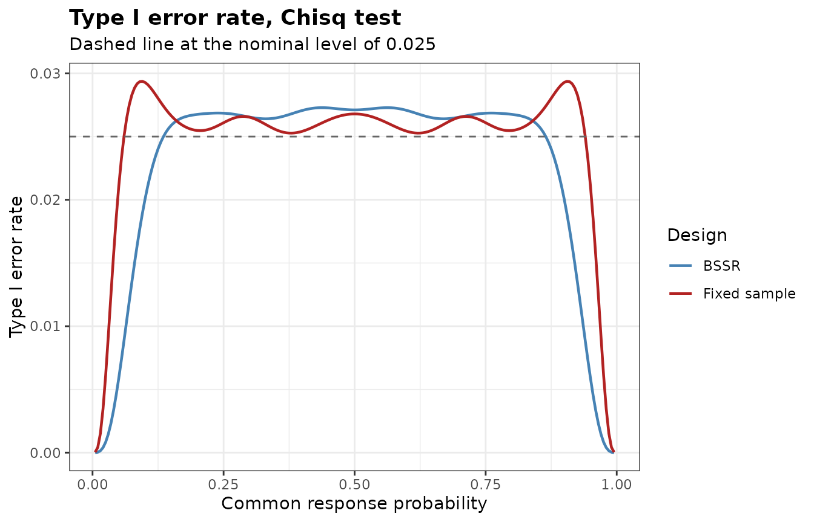
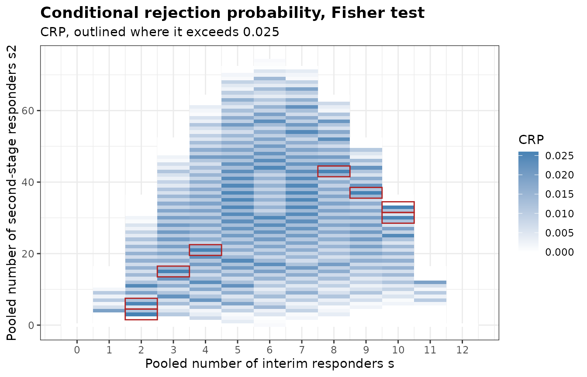
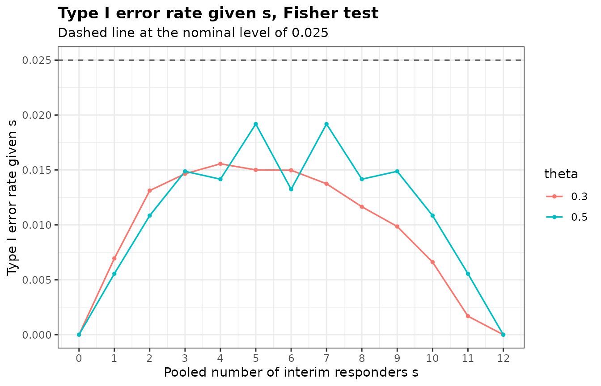

# Type I Error Rate of a Re-estimation Design

``` r

library(bbssr)
```

## Why the rate has to be computed

The size of a test at a fixed sample size is a property of one rejection
region. With blinded sample size re-estimation the final sample size
depends on the pooled number of interim responders, whose distribution
depends on the common response probability $`\theta`$, and the rejection
probability under the null hypothesis averages rejection regions of
different sizes with weights that depend on $`\theta`$. A test that
keeps the nominal level at every fixed sample size need not keep it for
this average, so the type I error rate of a re-estimation design is
computed for the design itself.

Under the null hypothesis $`p_{1} = p_{2} = \theta`$. Let $`n_{11}`$ and
$`n_{12}`$ be the interim sample sizes of the two groups, $`s`$ the
pooled number of interim responders, $`n_{21}(s)`$ and $`n_{22}(s)`$ the
second-stage sample sizes reached from $`s`$, and $`\mathcal{R}_{s}`$
the rejection region at the final sample size reached from $`s`$. The
type I error rate is
``` math
\mathrm{TIE}(\theta) = \sum_{s = 0}^{n_{11} + n_{12}} \Pr_{\theta}(S = s) \,
\Pr_{\theta}\bigl((X_{1}, X_{2}) \in \mathcal{R}_{s} \mid S = s\bigr) ,
```
a polynomial in $`\theta`$ that the package evaluates exactly.

## The rate over the nuisance parameter

[`BinaryTypeIErrorBSSR()`](https://gosukehommaex.github.io/bbssr/reference/BinaryTypeIErrorBSSR.md)
evaluates the type I error rate of a re-estimation design and of the
fixed-sample design with the initial sample size over a grid of
$`\theta`$, by default `seq(0.005, 0.995, by = 0.005)`, and refines the
three largest local maxima on the grid by a one-dimensional
optimization. The design below has an assumed difference of 0.3, an
initial sample size of 39 per group, an interim analysis after 20 per
group, re-estimation by formula (21.3) of Kieser (2020) and the
chi-squared test.

``` r

design <- list(Delta.A = 0.3, N1 = 39, N2 = 39, n.interim = c(20, 20), r = 1,
               alpha = 0.025, tar.power = 0.8, Test = 'Chisq', ss.method = 'standard')
tie <- do.call(BinaryTypeIErrorBSSR, design)
tie
#> Type I error rate of blinded sample size re-estimation for a binary endpoint
#> 
#>   Test            : Chisq
#>   Alternative     : greater
#>   Initial size    : N1 = 39, N2 = 39
#>   Interim size    : n1 = 20, n2 = 20
#>   Assumed effect  : 0.3 (RD)
#>   Nominal level   : 0.025
#>   Grid            : 199 values of theta in [0.005, 0.995], maxima refined
#> 
#> Largest type I error rate
#>        Design     theta     TIE
#>          BSSR 0.5623150 0.02729
#>  Fixed sample 0.0935671 0.02938
plot(tie)
```



The largest type I error rate is 0.02729 at $`\theta =`$ 0.5623 for the
re-estimation design and 0.02938 at $`\theta =`$ 0.09357 for the
fixed-sample design. The chi-squared test is not exact, so the
fixed-sample design can already exceed the nominal level, and the
re-estimation changes the rate again.

## Exact tests in the final analysis

The same design with an exact test in the final analysis gives the
following largest rates.

``` r

exact.max <- do.call(rbind, lapply(c('Fisher', 'Boschloo'), function(tst) {
  m <- attr(do.call(BinaryTypeIErrorBSSR, modifyList(design, list(Test = tst))), 'max')
  data.frame(Test = tst, Design = m$Design, theta = signif(m$theta, 4),
             TIE = signif(m$TIE, 4))
}))
exact.max
#>       Test Design  theta     TIE
#> 1   Fisher   BSSR 0.5259 0.01573
#> 2   Fisher   TRAD 0.5000 0.01540
#> 3 Boschloo   BSSR 0.3726 0.02312
#> 4 Boschloo   TRAD 0.5457 0.02477
```

For this rule the largest rate of the re-estimation design is 0.01573
with Fisher’s exact test and 0.02312 with the Boschloo test, against the
nominal 0.025. Whether the rate stays at or below the level is a
property of the rule and the test together. The guarantee of an exact
test holds at each fixed sample size and need not carry over to a sample
size chosen from the interim data, so the rate has to be checked for
each design.

## The adjusted significance level

When the rate exceeds the nominal level,
[`BinaryAlphaAdjBSSR()`](https://gosukehommaex.github.io/bbssr/reference/BinaryAlphaAdjBSSR.md)
finds the largest nominal level at which the largest type I error rate
does not exceed the target level, following Kieser and Friede (2000) and
Friede and Kieser (2004). With `adjust = 'test'` (the default) the
adjusted level is applied to the final analysis only. The re-estimated
sample sizes then do not depend on the level, the largest rate is a
non-decreasing step function of it, and the level is found by bisection.

Both searches below use the grid `theta.grid` of the common response
probability, which is coarser than the default to keep them short.

``` r

theta.grid <- seq(0.01, 0.99, by = 0.01)
adj <- do.call(BinaryAlphaAdjBSSR, c(design, list(theta = theta.grid)))
adj
#> Adjusted significance level for blinded sample size re-estimation
#> 
#>   Test            : Chisq
#>   Alternative     : greater
#>   Adjusted part   : final analysis only
#>   Target level    : 0.025
#> 
#>        Design   max.TIE alpha.adj max.TIE.adj
#>          BSSR 0.0272864 0.0204376   0.0237418
#>  Fixed sample 0.0293761 0.0207700   0.0247660
```

With `adjust = 'both'` the adjusted level is used in the re-estimation
as well. The re-estimated sample sizes then change with the level, the
rate need not be monotone in it, and the level is lowered in steps of
`step` until the rate is controlled. The search below uses a step of
0.00005, coarser than the default, to keep it short.

``` r

adj.both <- do.call(BinaryAlphaAdjBSSR,
                    c(design, list(adjust = 'both', step = 5e-5, theta = theta.grid)))
adj.both
#> Adjusted significance level for blinded sample size re-estimation
#> 
#>   Test            : Chisq
#>   Alternative     : greater
#>   Adjusted part   : final analysis and re-estimation
#>   Target level    : 0.025
#> 
#>        Design   max.TIE alpha.adj max.TIE.adj
#>          BSSR 0.0272864   0.02110   0.0246043
#>  Fixed sample 0.0293761   0.02077   0.0247660
```

The adjusted level of the re-estimation design is 0.02044 when it
applies to the final analysis only and 0.0211 when it also applies to
the re-estimation. The power at the adjusted level follows from
[`BinaryPowerBSSR()`](https://gosukehommaex.github.io/bbssr/reference/BinaryPowerBSSR.md)
with `alpha` set to the adjusted level. The re-estimation keeps the
target level through `ss.alpha` when the level was adjusted with
`adjust = 'test'`.

``` r

adjusted <- modifyList(design, list(alpha = adj$alpha.adj[1], ss.alpha = 0.025))
power.adj <- do.call(BinaryPowerBSSR,
                     c(adjusted, list(p = c(0.3, 0.4, 0.5), Delta.T = 0.3)))
power.nominal <- do.call(BinaryPowerBSSR,
                         c(design, list(p = c(0.3, 0.4, 0.5), Delta.T = 0.3)))
data.frame(p = power.adj$p, power.nominal = round(power.nominal$power.BSSR, 4),
           power.adjusted = round(power.adj$power.BSSR, 4))
#>     p power.nominal power.adjusted
#> 1 0.3        0.7984         0.7730
#> 2 0.4        0.8031         0.7685
#> 3 0.5        0.8037         0.7646
```

## Conditional rejection probabilities

[`BinaryCondRejectBSSR()`](https://gosukehommaex.github.io/bbssr/reference/BinaryCondRejectBSSR.md)
takes the calculation apart. Given the pooled number $`s`$ of interim
responders and the pooled number $`s_{2}`$ of second-stage responders,
the number of responders of group 1 in each stage is hypergeometric
under the null hypothesis, and the two stages are independent. The
rejection probability given $`s`$ and $`s_{2}`$,
``` math
\mathrm{CRP}(s, s_{2}) = \sum_{x_{11}} \sum_{x_{21}} h_{1}(x_{11} \mid s) \, h_{2}(x_{21} \mid s_{2}) \,
\mathbf{1}\bigl\{(x_{11} + x_{21}, \, s + s_{2} - x_{11} - x_{21}) \in \mathcal{R}_{s}\bigr\} ,
```
where $`h_{1}`$ and $`h_{2}`$ are the hypergeometric probabilities of
the two stages, does not depend on $`\theta`$. The type I error rate is
its average over the binomial distributions of $`s`$ and $`s_{2}`$,
``` math
\mathrm{TIE}(\theta) = \sum_{s} \sum_{s_{2}} b(s; n_{11} + n_{12}, \theta) \,
b\bigl(s_{2}; n_{21}(s) + n_{22}(s), \theta\bigr) \, \mathrm{CRP}(s, s_{2}) ,
```
where $`b`$ is the binomial probability. The rate is therefore at most
$`\alpha`$ for every $`\theta`$ whenever $`\mathrm{CRP}`$ is at most
$`\alpha`$ for every outcome. The column `CRP.total` is the rejection
probability given only the total $`s + s_{2}`$, with the responder count
of group 1 treated as one hypergeometric count among all final patients.
Fisher’s exact test keeps it at or below $`\alpha`$ by construction.

``` r

crp <- BinaryCondRejectBSSR(
  Delta.A = 0.3, N1 = 12, N2 = 12, n.interim = c(6, 6), r = 1, alpha = 0.025,
  tar.power = 0.8, Test = 'Fisher', ss.method = 'standard', theta = c(0.3, 0.5)
)
crp
#> Conditional rejection probabilities of blinded sample size re-estimation
#> for a binary endpoint, under equal response probabilities
#> 
#>   Test            : Fisher
#>   Alternative     : greater
#>   Initial size    : N1 = 12, N2 = 12
#>   Interim size    : n1 = 6, n2 = 6
#>   Assumed effect  : 0.3 (RD)
#>   Nominal level   : 0.025
#>   Outcomes        : 567 pairs (s, s2)
#>   Above the level : 8 for CRP, 0 for CRP.total
#> 
#> Largest conditional rejection probability
#>   Quantity   value s s2 N1 N2
#>        CRP 0.02597 2  3 24 24
#>  CRP.total 0.02500 3 15 32 32
#> 
#> Type I error rate over 2 values of theta: largest 0.01581 at theta = 0.5
plot(crp)
```



`CRP` exceeds the nominal level at 8 outcomes and `CRP.total` at 0. The
allocation is fixed within each stage, so the responder count of group 1
given $`s`$ and $`s_{2}`$ is the sum of two hypergeometric counts rather
than one, and `CRP` differs from `CRP.total` even when the sample size
is not re-estimated. Whether the outcomes above the level raise the type
I error rate is seen from the decomposition by $`s`$, which `theta`
requests.

``` r

by.s <- attr(crp, 'by.s')
head(by.s)
#>   theta s N1 N2     prob.s       TIE.s contribution
#> 1   0.3 0  6  6 0.01384129 0.000000000 0.0000000000
#> 2   0.3 1 14 14 0.07118376 0.006945771 0.0004944261
#> 3   0.3 2 24 24 0.16779030 0.013122889 0.0022018935
#> 4   0.3 3 32 32 0.23970043 0.014650674 0.0035117727
#> 5   0.3 4 38 38 0.23113970 0.015559790 0.0035964851
#> 6   0.3 5 42 42 0.15849579 0.015005504 0.0023783092
attr(crp, 'TIE')
#>   theta        TIE
#> 1   0.3 0.01387632
#> 2   0.5 0.01580768
plot(crp, what = 'by.s')
```



`TIE.s` is the type I error rate given $`s`$, and `contribution` is its
product with the probability `prob.s` of $`s`$. The contributions add up
to the type I error rate at each value of `theta`, which is 0.01388 and
0.01581 here.

## Non-inferiority

With a non-inferiority margin,
[`BinaryTypeIErrorBSSR()`](https://gosukehommaex.github.io/bbssr/reference/BinaryTypeIErrorBSSR.md)
and
[`BinaryAlphaAdjBSSR()`](https://gosukehommaex.github.io/bbssr/reference/BinaryAlphaAdjBSSR.md)
evaluate the rate on the boundary of the null hypothesis, parametrized
by the pooled response probability, see the `bbssr-non-inferiority`
vignette.
[`BinaryCondRejectBSSR()`](https://gosukehommaex.github.io/bbssr/reference/BinaryCondRejectBSSR.md)
covers tests of superiority only, since on the boundary of a
non-inferiority hypothesis the two response probabilities differ and the
conditional distributions of the responder counts depend on them.

## References

Friede, T. and Kieser, M. (2004). Sample size recalculation for binary
data in internal pilot study designs. *Pharmaceutical Statistics*, 3,
269-279.

Kieser, M. (2020). *Methods and Applications of Sample Size Calculation
and Recalculation in Clinical Trials*. Springer.

Kieser, M. and Friede, T. (2000). Re-calculating the sample size in
internal pilot study designs with control of the type I error rate.
*Statistics in Medicine*, 19, 901-911.
